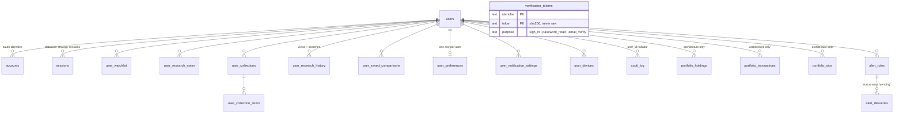

# Auth, Cloud Sync & Alerts — Architecture, API, and Operations

Documents the backend built in the "Personal Investment Operating System" cloud-sync sprint:
authentication, the 20-table Neon schema, the `/api/v1/sync/*` REST layer, the alert engine, and
the localStorage-to-cloud migration. Scope is backend-only per that sprint's own instructions —
frontend integration (wiring existing components to call these APIs instead of localStorage) is
future work, not something this document claims is done. See [RUNBOOK.md](RUNBOOK.md) for the
pre-existing AMFI/NAV ingestion pipeline, which this sprint did not touch.

## 1. Architecture

**No Row-Level Security.** Every table in `sql/neon/002_auth_and_user_data.sql` has RLS off.
`DATABASE_URL` is server-only (Next.js Route Handlers, never the browser), so authorization is
enforced entirely in application code: every query touching user-owned data has an explicit
`where user_id = $1`, or proves ownership by joining through a parent that has one (collection
items, alert deliveries — neither has its own `user_id` column). This is stricter in practice
than RLS (no code path can reach the database directly from a client at all), but it means a
missing `user_id` clause in any single query is a real, silent IDOR, not a defense-in-depth gap.
Every route handler in `frontend/app/api/v1/` was written and tested against this rule.

**Auth.js v5 (`next-auth@5.0.0-beta.31`), custom adapter.** `frontend/app/lib/authAdapter.js`
implements the standard Adapter interface against this repo's own snake_case schema, rather than
the stock `@auth/pg-adapter` package's schema — chosen so the schema stays internally consistent
with the rest of the codebase instead of depending on a third-party package's exact column names
being reproduced correctly. `frontend/app/lib/auth.js` registers Credentials (bcrypt, cost 12)
unconditionally, and Google / GitHub / Resend (magic link) each only when their env vars are
present — a deploy missing an OAuth secret just doesn't show that button, it doesn't break.

**Session strategy: database, with an automatic jwt fallback.** Auth.js refuses `"database"`
session strategy when Credentials is the *only* registered provider (it requires at least one
non-Credentials provider present — see `@auth/core`'s own `assert.js`). `auth.js` computes this
at startup: `hasDatabaseUrl && (hasGoogle || hasGitHub || hasResend)` → `"database"`, otherwise
`"jwt"`. This matters operationally: **a deploy with only `DATABASE_URL` set (no OAuth/Resend
keys yet) runs in `jwt` mode**, meaning real session revocation (password reset, account deletion,
"Secure Logout") does **not** invalidate already-issued cookies — they stay valid until natural
expiry. This stops being true the moment any second provider is configured. See §8.

**Data source split.** Mutual fund/NAV data (`funds.json`, `daily.json`) is a static bundle,
untouched by this sprint. User-owned data (auth, watchlist, notes, alerts, ...) lives in Neon,
read/written exclusively through `frontend/app/lib/db.js`'s pooled `query()`. The alert engine
(`frontend/app/lib/alertEngine.js`) is the one place these two worlds meet: it reads fund data via
`getFund()`/`fundHealth()`/`researchPriority()` (all pure, already-existing functions) and writes
evaluation results into Neon.

## 2. ER Diagram

`portfolio_corporate_actions` is fund-level (keyed by `scheme_code`), not user-level — omitted
above since it has no FK to `users`. Full column-level detail is in the schema file itself; this
diagram is relationships only. See `sql/neon/002_auth_and_user_data.sql` for the authoritative
source — this document summarizes it, the SQL file is what actually runs.

## 3. API Reference

All `/api/v1/sync/*` and `/api/v1/account` routes require a session (401 without one) and scope
every query to the caller's own `user_id` — never a client-supplied one. `/api/v1/internal/alerts/run`
is the one exception (see §6).

| Method | Path | Notes |
|---|---|---|
| POST | `/api/auth/register` | Email+password. 409 on duplicate, 400 on weak password/bad email. |
| POST | `/api/auth/forgot-password` | Always 200 with an identical generic body — never reveals account existence. |
| POST | `/api/auth/reset-password` | `{email, token, password}`. Single-use token, sha256'd at rest. |
| * | `/api/auth/[...nextauth]` | Auth.js's own routes: `/session`, `/csrf`, `/signin`, `/signout`, `/callback/*`, `/providers`. |
| DELETE | `/api/v1/account` | `{confirmEmail}` must match the session's own email. Cascades everywhere. |
| GET/POST | `/api/v1/sync/watchlist` | POST is idempotent (`ON CONFLICT DO NOTHING`, returns existing row). |
| DELETE | `/api/v1/sync/watchlist/:schemeCode` | |
| GET/POST | `/api/v1/sync/notes` | GET supports `?schemeCode=` filter. |
| PUT/DELETE | `/api/v1/sync/notes/:id` | |
| GET/POST | `/api/v1/sync/history` | GET supports `?type=` and `?limit=` (max 100). `type: 'search'` reuses this table (see §5). |
| GET/POST | `/api/v1/sync/comparisons` | POST replaces by name (check-then-write; no unique constraint exists for `ON CONFLICT`). |
| DELETE | `/api/v1/sync/comparisons/:id` | |
| GET/POST | `/api/v1/sync/collections` | GET returns each collection with a nested `items` array (single query, `json_agg`). |
| DELETE | `/api/v1/sync/collections/:id` | |
| POST | `/api/v1/sync/collections/:id/items` | Ownership proven by joining through the parent collection first. |
| DELETE | `/api/v1/sync/collections/:id/items/:schemeCode` | |
| GET/PUT | `/api/v1/sync/preferences` | |
| GET/POST | `/api/v1/sync/alerts` | `alertType` ∈ health_score, attention_score, news, factsheet, benchmark, category, amc, research_queue. |
| PUT/DELETE | `/api/v1/sync/alerts/:id` | PUT toggles `enabled` and/or replaces `condition`. |
| GET | `/api/v1/sync/alerts/deliveries` | Joined through `alert_rules.user_id`. |
| GET/PUT | `/api/v1/sync/notification-settings` | PUT upserts one `(alertType, channel)` pair at a time. |
| POST | `/api/v1/sync/migrate` | One-shot; see §5. |
| POST | `/api/v1/internal/alerts/run` | Secret-gated, evaluates every enabled rule for every user; see §6. |

Every list endpoint returns `{items: [...]}`. Every write returns the row it created/updated
(or `204` for deletes). Error responses are `{error: "..."}` with an appropriate 4xx.

## 4. Authentication

Required env vars for `DATABASE_URL`-backed auth to work at all: `DATABASE_URL`, `AUTH_SECRET`
(any 32+ byte random string — `openssl rand -base64 32`). Everything else is optional and
additive:

| Var | Enables |
|---|---|
| `GOOGLE_CLIENT_ID` / `GOOGLE_CLIENT_SECRET` | Google OAuth button |
| `GITHUB_CLIENT_ID` / `GITHUB_CLIENT_SECRET` | GitHub OAuth button |
| `RESEND_API_KEY` | Magic-link sign-in button (Auth.js's own Resend provider) **and** password-reset emails (`frontend/app/lib/email.js`, a separate Resend SDK call — the two are independent, both gated on this one key) |
| `EMAIL_FROM` | From-address for both of the above; defaults to `MF Pulse <no-reply@mf-pulse.app>` |
| `ALERTS_INTERNAL_SECRET` | Enables `/api/v1/internal/alerts/run` (503 without it) |
| `NEXTAUTH_URL` | **Security-relevant, not just cosmetic.** Password-reset emails embed this as the link's origin instead of trusting the incoming request's own Host header — a spoofed Host could otherwise redirect a real user's reset link (and its live token) to an attacker's domain. Falls back to a hardcoded known-good production URL if unset, never to the request itself. Set this explicitly in Vercel rather than relying on the fallback. |

`AUTH_TRUST_HOST` is not needed — `trustHost: true` is set directly in `auth.js` so Vercel's
dynamic host headers work without an extra env var to remember. This is a separate concern from
`NEXTAUTH_URL` above: `trustHost` affects Auth.js's own internal routing, not the reset-link URL.

## 5. Migration

`POST /api/v1/sync/migrate` imports whatever a user built anonymously in `localStorage`
(`mfp_watchlist`, `mfp_research_notes`, `mfp_recent_views`, `mfp_recent_searches`,
`mfp_recent_compares` — see `frontend/app/lib/sessionMemory.js` for the shapes these mirror)
into the tables above. It's idempotent via an `audit_log` row with `action = 'sync_migrate'` —
already-migrated users get `{migrated: false, reason: "already_migrated"}` instantly rather than
re-importing, so it's safe to call on every sign-in.

`frontend/app/lib/migrateLocalData.js` is the client-side trigger (the server can't read
`localStorage`), wired into the two sign-in flows this sprint owns end-to-end: credentials login
and register's auto-sign-in (`frontend/app/login/page.js`, `frontend/app/register/page.js`).
**It is not wired into OAuth or magic-link sign-in** — those redirect through Auth.js's own
callback flow to a page outside this sprint's scope (would need a hook in the shared root layout,
which belongs to whoever owns frontend chrome, not this sprint). A user who only ever signs in
via Google will not have their pre-signup localStorage data migrated until this gap is closed.

## 6. Deployment

**On Vercel**, set at minimum `DATABASE_URL` and `AUTH_SECRET` as production env vars (the
existing `NEXT_PUBLIC_SUPABASE_*` vars are unrelated — that's the AMFI/NAV data source, not
auth). Add OAuth/Resend vars from §4 as those integrations go live. `ALERTS_INTERNAL_SECRET` is
only needed once something is actually calling `/api/v1/internal/alerts/run` — **nothing does
yet**. This sprint deliberately did not wire a GitHub Actions cron step (or any other scheduler)
to call it; that's a scheduling/delivery-infrastructure decision explicitly out of scope for
"alert engine backend, no delivery infra." The endpoint is real and tested, just not yet invoked
by anything on a schedule.

**Local dev** needs the same `DATABASE_URL`/`AUTH_SECRET` in `frontend/.env.local` (gitignored).
Point it at a Neon branch, not the production branch — branches are free, instant, copy-on-write,
and this is exactly what they're for. Every route in this sprint was verified against a
disposable branch created for that purpose, not against production data.

## 7. Testing

`node frontend/scripts/test_backend_sync.mjs [--base-url http://localhost:3000]` — 36 checks
across registration, login, every sync resource, migration idempotency, alert CRUD, and the
cross-user authorization boundary specifically (the single most important thing to keep passing
given §1's no-RLS design). Creates and deletes its own throwaway users; safe to run repeatedly
against a real database, including production, though pointing it at a disposable branch is
still the better default. No test framework dependency — plain Node + `fetch`.

## 8. Security review

An independent adversarial review (separate agent, full read of every file in §3 plus the
account-deletion route, cross-checked against the actual installed `@auth/core` source rather
than assumed library behavior) confirmed solid on: SQL injection (zero string-interpolated
queries across 70+ call sites, checked individually), IDOR/cross-user authorization (every
user-owned-table query scoped correctly, no missing `user_id` check found), XSS (zero
`dangerouslySetInnerHTML` anywhere in the app), CSRF (the session cookie's `httpOnly` +
`sameSite: "lax"` defaults genuinely block cross-site mutation — verified by reading Auth.js's
own cookie config, not assumed), token hashing (both the custom reset-token path and Auth.js's
own magic-link path independently confirmed to hash before persisting), and secrets hygiene (no
logging of sensitive values, no hardcoded credentials anywhere).

**Fixed as a direct result of the review:**
- Password-reset link origin no longer trusts the incoming request's Host — see the
  `NEXTAUTH_URL` row in §4. The prior code (`new URL(request.url).origin` as a fallback) was a
  real password-reset-poisoning vector if `NEXTAUTH_URL` were ever left unset in production.
- Two timing side-channels closed: `forgot-password` no longer `await`s the outbound email send
  in the response path (was a network-round-trip-sized gap between "account exists" and "account
  doesn't" despite identical response bodies), and `authorize()` now always runs one `bcrypt.compare`
  — against a fixed dummy hash when no real user/password exists — instead of short-circuiting.
- `alert_rules` creation is capped at 50/user (429 past the limit) — the one endpoint whose
  uncapped growth directly degrades a shared, unpaginated resource (every enabled rule for every
  user is loaded on each `/api/v1/internal/alerts/run` call).
- `sync/migrate`'s `notes` object had every array-shaped input capped at 500 items except the
  outer scheme-code key count itself, which is now capped too — closes the one concrete resource-
  exhaustion path the review found (an attacker-controlled payload with tens of thousands of keys
  turning one request into tens of thousands of sequential inserts).
- The internal alerts-run secret now compares with `crypto.timingSafeEqual` instead of `!==`.

**Confirmed real, deliberately not fixed this pass (documented, not silently left):**
- **JWT-mode sessions don't revoke.** Password reset and account deletion correctly delete
  `sessions` rows, which only matters in `"database"` strategy. In the bare-`DATABASE_URL`-only
  `"jwt"` fallback (§1), an already-issued cookie remains cryptographically valid until its
  30-day `maxAge` regardless. Only affects deployments with zero OAuth/Resend providers
  configured — closing it properly (e.g. a `jwt` callback checking issued-at against a
  `password_changed_at` column) is real scope, not a one-line fix.
- **Credentials registration doesn't verify email ownership.** `email_verified` stays null
  forever for credentials signups; anyone can register an email they don't control. Bounded
  impact — the real owner can reclaim it via forgot-password (which does require mailbox access),
  and Auth.js's own default blocks silently linking an OAuth sign-in to an unverified-email
  account — but it's a real gap against standard practice, not implemented here since it needs
  the same email infrastructure this backend only optionally has (`RESEND_API_KEY`).
- **No rate limiting anywhere in this surface.** `register`, `forgot-password`, and login have no
  throttling — register can be scripted to mass-create accounts, forgot-password can be used to
  spam a target's inbox (and costs real money per call via Resend), login has no brute-force
  lockout beyond bcrypt's own cost. Low real-world risk at near-zero current users; becomes a
  must-fix the moment there's a real user base worth targeting.

## 9. Known limitations (non-security)

- **Five of eight alert types are schema-only.** `health_score`, `attention_score`, and `news`
  have real evaluation logic wired to real scoring functions. `factsheet`, `benchmark`,
  `category`, `amc`, and `research_queue` are valid values a rule can be *created* with, but
  `evaluateRule()` honestly returns `skipped: true` with a reason for them rather than faking a
  result — there's no persisted benchmark/category/AMC-level scoring data to evaluate against
  yet. See `frontend/app/lib/alertEngine.js`'s own header comment.
- **`/api/v1/internal/alerts/run` doesn't scale past a few thousand rules as written.** It's a
  single synchronous loop issuing 2-4 sequential DB round-trips per triggered rule (channel
  lookup, N delivery inserts, a condition-state update). At real scale (see the capacity report)
  this needs to become a batched/queued job, not a single HTTP handler.
- **`idx_alert_rules_user` is a partial index** (`where enabled`) — `GET /api/v1/sync/alerts/deliveries`
  needs both enabled and disabled rules to find a user's full delivery history, so that query
  can't use it once a user has any disabled rules. Invisible at current scale; a plain
  `(user_id)` index alongside the existing partial one is the fix, not yet applied since it
  would be another production migration for zero present benefit.
