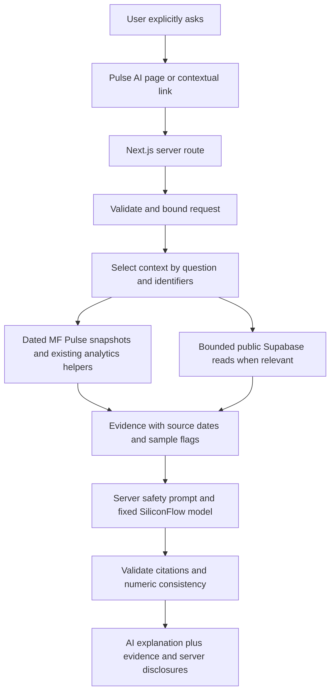

# Pulse AI — grounded mutual-fund research

Pulse AI adds `/ai` and `POST /api/ai/chat` to MF Pulse. It explains the platform's
existing NAV observations and deterministic analytics with request-local evidence.
It is a research copilot, not a trading agent, a personal adviser, or a replacement
for `/brief`, the explanation engine, or fund calculations.

## Architecture discovered

- Next.js 14 App Router, JavaScript, React 18, Tailwind; financial-terminal design
  tokens, panels, badges, navigation and mobile menu are reused.
- Production reads Supabase PostgREST directly. FastAPI exists but is not needed on
  the serving path. No new service, vector database, schema migration or SDK is added.
- Python ingests AMFI NAV, SEBI-style monthly exports and official AMC factsheets.
  Postgres stores scheme/NAV/flow facts, pipeline health, append-only observations,
  and events. dbt and pipeline quality gates remain untouched.
- `funds.json`, `performance.json`, `daily.json`, and `amc_trend.json` are real-data,
  generated snapshots, not automatically fresh just because Supabase is fresh.
  At implementation, daily/performance snapshots end on **2026-06-23**, while the
  AMC trend window ends **2026-06-19**. Source dates are preserved.
- `/compare` compares **AMCs**, not individual schemes. Pulse AI sends selected AMC
  identifiers and reloads their data server-side. For a two-fund comparison, enter
  two six-digit scheme codes, or use the fund page's contextual link for one fund.
- Monthly flow/signals remain **SAMPLE**. They are never treated as authoritative
  SEBI observations. `/brief` is deterministic and is unchanged.



## Provider research — checked 21 September 2026

Selected: **SiliconFlow**, Chinese provider, exact model **`Qwen/Qwen3.5-4B`**.
Endpoint: **`https://api.siliconflow.cn/v1/chat/completions`**.

The official [pricing catalogue](https://www.siliconflow.cn/pricing) was opened in
an interactive browser. Searching `Qwen3.5-4B` and selecting its result exposed the
exact model row under chat models with **免费** (free) for both input and output.
This is free-priced inference, not merely a new-user token credit. It is a current
pricing observation, **not a promise that pricing will remain free forever**.
[Chat API documentation](https://docs.siliconflow.cn/docs/api/chat-completions-post)
confirms the Bearer-authenticated endpoint and completion controls.

[Free-model limits documentation](https://docs.siliconflow.cn/docs/userguide/faqs/rate-limit-and-upgradation)
says identity verification is required for free models, calls are billed at zero,
and free limits are fixed per model/account. Exact Qwen3.5-4B RPM/TPM numbers were
not exposed publicly in this review: inspect the model's Rate Limits in your
account console. Do not mistake the generic chat limits table for this free model.

[Identity verification documentation](https://docs.siliconflow.cn/docs/userguide/faqs/authentication)
lists supported mainland/Hong Kong/Macao/Taiwan documents and a foreign permanent
residence permit. Ordinary overseas passports are not listed for online personal
verification. If your document is unsupported, use the official support form linked
there. Do not bypass identity or geographic restrictions. Account access and a
successful free inference call have **not** been verified for the contributor.

Backup researched, **not automatically configured**: Alibaba Cloud Model Studio.
Its [new-user quota documentation](https://www.alibabacloud.com/help/en/model-studio/new-free-quota)
says the free quota is available in Singapore, and **Free Quota Only** is disabled
by default. If a future explicit provider change is needed: activate Model Studio
in Singapore, inspect the chosen model's remaining quota and expiry, open its model
details/Free Quota page, enable **Free Quota Only (worry-free mode)** for that model,
and verify it is on before any API call. Exhaustion must stop with
`AllocationQuota.FreeTierOnly`, not continue billing. This branch rejects Alibaba
endpoints; implementing a reviewed adapter would be a separate change. If
SiliconFlow is inaccessible, leave Pulse AI disabled.

The supplied Baidu competition article could not be retrieved. Competition fit is
based on the user's stated Wealth Advisory Agent theme, not an independently
verified claim of eligibility, rules compliance or endorsement.

## Grounding and supported scope

- Market: existing daily breadth, risk regime, attention explanations, daily movers;
  optional database NAV freshness check. The regime is read, not recalculated.
- Categories: bounded existing ranked 1M summaries, named categories when recognised.
- Funds: exact scheme code or full exact scheme name; NAV date, plan/option,
  available returns, ranks, peer comparison and risk interpretation. Existing
  `visibleReturns`, `benchmarkRows`, `riskInterpretation` are reused. No new return
  or score engine. Missing windows remain absent. IDCW caveats are included.
- AMC/comparison: selected identifiers reloaded from the same index snapshots and
  `marketIntel`; existing performance summary and a bounded Supabase scheme mix.
- Flow signals: at most three strongest absolute z-scores from a bounded read of
  the existing signal view, always SAMPLE. No simulated flow numbers are generated.
- Methodology: a versioned server-owned explanation of the existing calculations.
  External news, missing causes, forecasts, personal allocations and unavailable
  history cannot be supplied. Ambiguous fund names require a scheme code.
- Simple follow-ups reuse the last user topic for retrieval. Assistant history is
  never a financial source. This is a bounded keyword/entity router, not full NLU.

Each evidence record has `id`, `source`, `asOf`, `freshness`, `isSample`, `type`,
`href`, and `text`. IDs are created per request and cannot be provided by the
browser. The response returns all supplied evidence, plus `citedEvidenceIds` for
records actually referenced. “Grounded in” distinguishes cited records and lets
users inspect exact facts. Methodology has no fabricated financial date.

AI prose is rejected in full if it lacks citations, uses unknown IDs, has uncited
paragraphs, or contains numeric tokens absent from that paragraph's cited evidence.
HTML, external links, key-like strings, certain guarantees and direct buy/sell
phrases are also rejected. The system prompt requires exact values; unnecessary
rounding/calculations are avoided. These checks reduce hallucinations but **do not
prove semantic entailment**: the right number could still be attached to the wrong
claim. Human evidence inspection remains important. Conservative checks may reject
otherwise reasonable paraphrases; retry is explicit, never an automatic paid call.

Server-authored stale and SAMPLE disclosures are outside model control. Dates are
checked against request time instead of trusting cached `staleDays`. A newer live
NAV date never makes older computed performance fresh. Rank movement comparing 1M
with 3M is not represented as yesterday-to-today movement. Peer averages are not
benchmark-index returns; AMC index points are not fund returns.

## Request and response

```json
{
  "message": "Compare 119769 and 119835",
  "history": [],
  "pageContext": { "type": "market", "codes": [], "amcs": [] }
}
```

Context types: `market`, `fund`, `amc`, `comparison`, `signal`. Fund accepts one
code; comparisons accept up to two scheme codes **or** four AMC names. Metrics,
URLs, system prompts, provider/model choices and extra fields from the browser are
not trusted. No optional investor profile is collected in this release.

Successful responses include `answer`, `kind`, `provider`, `model`, `asOf` (a list
because sources can have different dates), `evidence`, `citedEvidenceIds`,
`warnings`, `isSampleDataIncluded`, and `disclaimer`. A deterministic safety or
insufficient-data response has `model: null` and `provider: null`.

## Security, cost and privacy

- Key is accessed server-side only; `server-only` guards the data adapter. Never
  put it in `NEXT_PUBLIC_*`. No service-role key or DB password is needed.
- One allowlisted HTTPS provider and exact free model. No arbitrary URL, redirects,
  SQL, model tools, transactions or provider fallback. No retries behind the scenes.
- Disabled by default. A missing key, invalid config, or a missing/expired operator
  pricing check fails closed. `AI_FREE_MODEL_VERIFIED_ON` is valid for seven days.
  Recheck the actual provider price before refreshing it. An operator check is not
  a real-time billing lock; provider pricing can change during this interval.
- 1,800-character question; six history entries, each at most 1,800 characters;
  16,000-byte request; 18 evidence records / 16,000 serialized context characters;
  900 output tokens; 6,000-character answer; 64 KB provider response.
- Supabase read timeout: four seconds. Provider timeout: 18 seconds. Client timeout:
  28 seconds. Server route duration: 30 seconds. No background/page-load inference.
- Process-local guard: two concurrent calls, twelve calls/minute. This bounds one
  instance, not a distributed public API. For broad public use, add platform WAF/
  distributed limits and provider-side limits. Same-origin checks are defence in
  depth, not authentication against bots.
- Conversations stay in component memory, not database/localStorage. The last six
  turns and selected public evidence are sent to SiliconFlow after explicit submit.
  Do not include account numbers, financial identity, or other private details.
  This app does not control provider retention; review provider terms before use.
- Events contain only page, context type, prompt index and safe error code; no
  question/answer text. AI events drop the referrer. URLs carry only entity IDs,
  not private questions. Error responses never echo provider bodies or stack traces.
- Practical prompt-injection mitigation: role/schema validation, fixed system
  policy, JSON-delimited untrusted history/evidence, no secrets in context, no tools,
  output checks. This is not a claim of perfect prompt-injection immunity.

## Setup — local or Vercel preview environment

1. Sign in at [SiliconFlow](https://cloud.siliconflow.cn/). Complete permitted
   account/identity verification; use official support if your documents are unsupported.
2. Open Model Square, select **Qwen/Qwen3.5-4B**, verify chat support and that both
   input and output prices remain free. Check your account's model rate limits.
3. Open **API Keys**, create a dedicated key, and store it only in a server secret.
   Do not paste it into source code, this document, screenshots, or public chat.
4. Copy `frontend/.env.example` to `frontend/.env.local`. Retain your existing
   `NEXT_PUBLIC_SUPABASE_URL` and public anon key for the original dashboard.
5. Set:

```dotenv
SILICONFLOW_API_KEY=<your private key, never commit>
SILICONFLOW_BASE_URL=https://api.siliconflow.cn/v1
SILICONFLOW_MODEL=Qwen/Qwen3.5-4B
AI_FEATURE_ENABLED=true
AI_FREE_MODEL_VERIFIED_ON=YYYY-MM-DD
```

Use the actual date of your free-pricing check, not a future date. If you cannot
verify free access, set `AI_FEATURE_ENABLED=false`. Do not recharge or select a Pro
model as a workaround. The `.env.example` files intentionally default to disabled.
For a preview, add the same server variables in Vercel project Settings → Environment
Variables, scoped to the feature branch's **Preview** environment. This task does
not deploy or change production configuration.

```sh
cd frontend
npm ci
npm test
npm run build
npm run dev -- --hostname 127.0.0.1
```

Open `/ai`, click a suggested prompt, then click **Ask Pulse AI**. Suggested prompts
only fill the composer; they do not call inference. Test market, one-fund, two-code
comparison, AMC comparison, flow, unsupported-question and stale-data scenarios.
Verify evidence dates and actual zero cost in the provider bill before a demo.

## Verification and failure behaviour

```sh
.venv/bin/python -m pytest tests/ -q
npm test --prefix frontend
cd frontend && npm run build
```

The Node built-in test runner covers schema limits, context bounds, real snapshot
selection, sample flags, missing config, no paid fallback, malicious history,
invented IDs/numbers, cross-origin requests, provider 401/403/429/5xx, invalid output,
timeout, load guards and complete mocked request flow. No large test framework added.
CI runs it before the build. CI's Python step also installs the pre-existing pinned
psycopg dependency required by the Excel parser test.

Optional **local-only** UI fixture: after starting the production build on port
3100, run `node tests/preview-ai.mjs` and open port 3101. This proxy exercises the
real chat UI with an explicitly labelled mocked completion and actual snapshot
breadth. It makes no provider calls, never reads an API key, is not imported by
Next.js, and must not be used as evidence of live model quality.

Missing/invalid key, disabled state, provider access failure, limits, timeout and
invalid response leave every underlying dashboard route available. AI failure is
shown with retry and data-status links. Supabase failure removes only the affected
source and explains the limitation; dated local evidence is still usable.

## Competition relevance and remaining limits

This demonstrates a Chinese-model wealth research participant that can interpret
real platform evidence, expose provenance, explain risk and admit missing data.
It does not claim personalised regulated advice or financial transactions.

Not implemented: optional Investor Lens (avoids collecting a profile before real
model evaluation), autonomous portfolio actions, full semantic citation verification,
arbitrary fund-name resolution, automatic pricing discovery, distributed rate
limits, and automatic Alibaba fallback. Snapshot refresh and live account setup
remain explicit operational actions. The underlying repository's dependency audit
also needs separate remediation before a production launch; see the implementation
report. No dependency upgrades or production deployment are included here.
