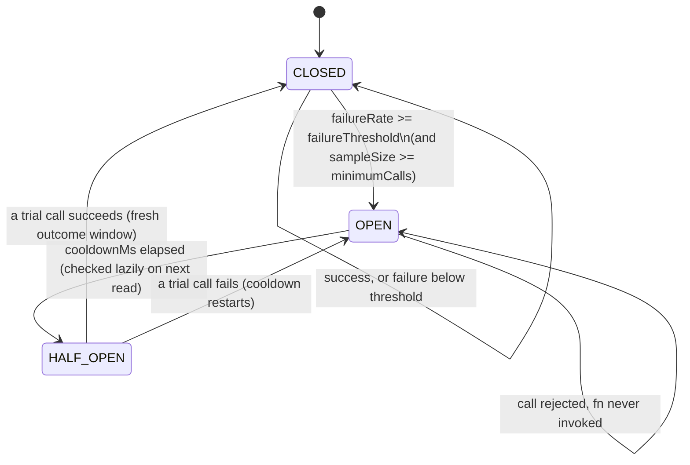

# Circuit Breaker Framework (Phase 4.5 — Step 2)

The second shared primitive of the Provider Infrastructure Layer: protects a caller from
repeatedly hammering a struggling downstream (a provider, an external API) by tripping open once
its recent failure rate crosses a threshold, failing fast without even attempting the call, then
cautiously probing recovery once a cooldown elapses.

Code: [frontend/app/lib/platform/circuitBreaker/core.js](../frontend/app/lib/platform/circuitBreaker/core.js)

## 1. Architecture



- **CLOSED** — normal operation. Every call passes through and its outcome (success/failure) is
  recorded into a rolling window of the last `windowSize` outcomes. Trips to OPEN once the
  failure rate within that window reaches `failureThreshold` — but only once at least
  `minimumCalls` outcomes have been recorded, so "1 failure out of 1 call" doesn't trip a breaker
  on a single unlucky request.
- **OPEN** — every call is rejected immediately (`err.circuitBreakerOpen = true`), `fn` is never
  invoked. This is the entire point: stop sending traffic to something that's already struggling.
  After `cooldownMs`, the NEXT state read or `execute()` call lazily transitions to HALF_OPEN —
  there's no background timer, so a breaker that's been idle past its cooldown still reports
  HALF_OPEN correctly the moment anyone asks.
- **HALF_OPEN** — admits up to `halfOpenMaxCalls` concurrent trial calls (default 1) to test
  recovery. Whichever settles first decides the transition: first success → CLOSED (with a fresh
  outcome window — past failures don't linger into the recovered state); first failure → OPEN
  again (cooldown restarts from that failure, not the original trip).

**State is in-memory, per breaker instance, per process.** On Vercel serverless this means state
is shared across requests handled by the same warm instance but does **not** persist across a
cold start and is **not** shared across concurrent instances. This is a documented limitation,
not a bug — none of today's consumers need cross-instance shared state (there are no real
external providers plugged in yet, per the standing Phase 4 constraint). A future Postgres-backed
store would slot in behind the same `execute()`/`getState()`/`getMetrics()` API without changing
any caller.

## 2. Composing with the Retry Framework

Circuit breaker and retry are orthogonal, composable concerns — this module doesn't couple to
`retry/core.js`. Two valid compositions, depending on what you want:

```js
import { createCircuitBreaker } from "../platform/circuitBreaker/core.js";
import { withRetry } from "../platform/retry/core.js";

const emailBreaker = createCircuitBreaker("email-provider");

// A) Retries INSIDE the breaker's view — each individual attempt is recorded as its own
//    outcome. Use when transient blips shouldn't count against the breaker as harshly.
await emailBreaker.execute(() => withRetry(() => sendEmail(msg), { maxAttempts: 3 }));

// B) Retries OUTSIDE the breaker — a single breaker-rejected call is one recorded failure,
//    and withRetry's own backoff naturally spaces retry attempts across the breaker's cooldown.
await withRetry(() => emailBreaker.execute(() => sendEmail(msg)), { maxAttempts: 3 });
```

## 3. Extension guide

**A new provider adapter wanting circuit protection:**

```js
import { createCircuitBreaker } from "../platform/circuitBreaker/core.js";

const breaker = createCircuitBreaker("bse-star-mf", {
  failureThreshold: 0.5,   // trip at 50% failures...
  minimumCalls: 5,         // ...within at least 5 recent calls
  cooldownMs: 30_000,      // wait 30s before probing recovery
});

export async function placeOrder(order) {
  return breaker.execute(() => bseClient.placeOrder(order));
}

export function getBreakerStatus() {
  return breaker.getMetrics(); // feeds the future Provider Registry's health reporting
}
```

**Operational overrides** — `breaker.forceOpen(reason)` to protect a known-bad provider before
it's failed enough calls to trip organically (e.g. an incident channel says "BSE is down for
maintenance"); `breaker.reset()` to force it back to CLOSED after confirming recovery out of
band. Both are meant for future ops tooling (Phase 4.5 step 7's dashboard APIs), not end users.

**Every provider should register its breaker's `getMetrics()`** into the future Provider
Registry (step 4) so `GET /api/internal/providers/health` can report Circuit Breaker Status
platform-wide without each provider inventing its own reporting shape.

## 4. Failure modes & recovery

| Situation | Behavior | Recovery |
|---|---|---|
| Downstream degrades gradually | Breaker trips once failure rate crosses threshold with enough samples | Automatic — OPEN protects it from further load; HALF_OPEN probes recovery after cooldown |
| Downstream recovers | First HALF_OPEN trial call succeeds → CLOSED, fresh window | Automatic |
| Downstream is still broken when probed | First HALF_OPEN trial call fails → back to OPEN, cooldown restarts | Automatic; repeats until a trial call succeeds |
| A single unlucky failure on low traffic | Does not trip alone — `minimumCalls` guards against trip-on-first-failure | N/A, by design |
| Operator knows a provider is down before it's failed calls | `forceOpen(reason)` | `reset()` once confirmed healthy |
| Caller calls `execute()` while OPEN | Rejected immediately with `circuitBreakerOpen: true`, `fn` never runs | Wait for cooldown, or fix/confirm the downstream and `reset()` |

## 5. Testing

- **Unit tests** (`core.test.js`, 15 tests): every state transition (CLOSED→OPEN on threshold+
  minimumCalls, OPEN→HALF_OPEN on cooldown elapse via an injectable clock, HALF_OPEN→CLOSED on
  success with window reset, HALF_OPEN→OPEN on failure with cooldown restart), the
  below-minimumCalls non-trip guard, the rolling window's eviction of stale outcomes,
  `getMetrics()`'s full field set, `reset()`'s operational-vs-lifetime state split, `forceOpen()`.
- **Concurrency**: one test proves `halfOpenMaxCalls` correctly caps concurrent trial calls (a
  third concurrent call while two trials are still pending is rejected); another proves many
  concurrent successful calls against one breaker don't corrupt its outcome window.
- **Failure tests**: the OPEN-state fast-fail path is asserted to never invoke `fn` at all
  (`vi.fn()` call-count assertion), proving the "protect the downstream" guarantee directly.
- **Integration / Real-Neon / Route tests**: not applicable yet — this module has no external
  dependencies and no live consumer wired in today (that's Provider Registry, step 4, and the
  Notification Infrastructure's mock channels, step 6). It will gain real-Neon/route coverage
  once a real consumer exists to exercise it end-to-end, rather than manufacturing a synthetic
  one now.
- **Deployment verification**: `npm run build` clean, full 40+ file suite green.

## 6. Verification record

- 15/15 unit tests green.
- Full suite green after adding this module (no other file touches it yet — zero risk of
  regression to existing subsystems).
- Lint clean, production build clean.
