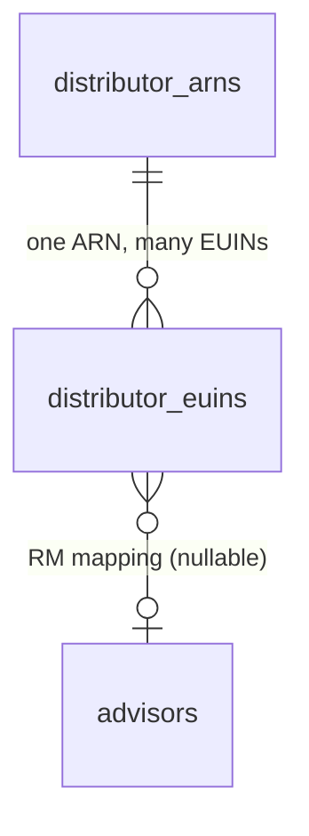

# Distributor Identity & Regulatory Configuration

Suasion Securities' own AMFI-registered distributor identity — ARN and the EUIN(s) registered
under it — config/database-backed rather than hardcoded, so every order/mandate/document/audit
touchpoint that needs distributor attribution reads it from here, and so does any future real
provider adapter (BSE StAR MF, CAMS, KFintech).

Code: [frontend/app/lib/platform/distributor/core.js](../frontend/app/lib/platform/distributor/core.js)
· Schema: [sql/neon/017_distributor_identity.sql](../sql/neon/017_distributor_identity.sql)

Recorded distributor values (2026-07-24): **ARN 289322**, **EUIN E544323**, distributor name
**Suasion Securities**. These are seeded directly by the migration rather than configured in UI
code. Their current AMFI status and ARN validity date still require documentary verification;
presence in the database must not be interpreted as production authorization.

## 1. Why two tables, not one

Real AMFI structure is two-level: **one ARN** is a firm-level distributor registration; **many
EUINs** are individual-employee registrations under that ARN. `distributor_arns` models the
former, `distributor_euins` the latter, with a foreign key between them. Today there is exactly
one row in each table — but the shape already supports "multiple advisors and EUINs under the
same ARN" without a future migration, per the brief that requested this module.

`distributor_euins.advisor_id` is the RM-mapping hook — nullable today because no order-placement
flow yet passes an advisor/placed-by context (`orderService.js`'s `createOrder` doesn't accept
one, and `investment_orders.placed_by_user_id` is populated by nothing yet). This column exists
so that when advisor-assisted ordering lands (Journey 5), wiring it up is "add an `advisor_id` to
an existing EUIN row and pass an advisor context through," not a schema change.

## 2. API

- **`getDefaultDistributorAttribution()`** — the EUIN used when no more specific advisor context
  applies. This is every order and SIP mandate today, since nothing yet passes an advisor
  context. Throws if no active default EUIN is configured — a real order with no distributor
  attribution at all would be a genuine data-integrity problem once a distributor identity is
  supposed to exist, not a degraded-but-acceptable state.
- **`getDistributorAttributionForAdvisor(advisorId)`** — prefers an EUIN specifically mapped to
  the given advisor; falls back to the default if none is mapped, or if `advisorId` is
  null/undefined. Not called from any live path yet (see §1) — ready for when one exists.
- **`getDistributorProfile(arn)`** — full read of one firm and every EUIN under it, for
  disclosure/display surfaces that need more than the single default attribution (e.g. a future
  operator-facing distributor-profile view). Returns `null` for an unknown ARN.

## 3. Where attribution is stamped, and why at creation time

`distributor_arn`/`distributor_euin` are **snapshot columns** on `investment_orders` and
`sip_mandates`, populated once at row-creation time (`orderService.js`'s `createOrder` and
`createSipMandate`) — not a live join to the distributor tables. This must freeze at the moment a
transaction comes into existence: a later change to the EUIN roster (a new default, an advisor
reassignment) must never rewrite which distributor gets credit for a transaction that already
happened. This is the same snapshot-not-live-reference principle already applied elsewhere in
this schema (e.g. `portfolio_folio`'s encrypted-at-rest folio number, every
`provider_reference`-style column) — see the migration's own comments.

Everywhere attribution flows from that one stamped snapshot, not a fresh lookup:

- **`InvestmentProvider.placeOrder()`/`createSIPMandate()` payloads** — `orderService.js` passes
  `distributorArn`/`distributorEuin` from the already-stamped order/mandate row into the object
  given to the provider. No interface or mock change was needed: both methods already accept a
  flexible object and (in the mock) echo it back verbatim, so a future real adapter receives
  these fields structurally without any interface change.
- **Order-confirmation documents** — `orderService.js`'s completion hook passes
  `{ distributorArn, distributorEuin }` as `generateDocument()`'s new `metadata` parameter (added
  to `documentService.js`, stored in the pre-existing `documents.metadata` jsonb column, which
  was defined in schema but never populated before this).
- **Audit trail** — `logAudit("order_created", ...)` and `logAudit("sip_mandate_created", ...)`
  both include the attribution in their metadata.
- **UI** — the order review screen (before submit) and the post-submit confirmation both display
  `ARN <arn> / EUIN <euin>` when present, reading it directly off the order object the API
  already returns (`select *` picks up the new columns with no route change needed).

## 4. What was deliberately NOT done in this slice

- **Notification body text.** ARN/EUIN attribution belongs on regulated transaction
  confirmations/statements (documents), not inside a push/in-app notification's message copy —
  no AMFI/SEBI disclosure requirement applies to notification text specifically. The distributor
  data is available to any future template that needs it; existing order notifications weren't
  changed to print it, since that would be cosmetically-compliant-looking without being a real
  disclosure requirement.
- **Advisor-assisted order placement.** `getDistributorAttributionForAdvisor()` exists and is
  tested, but nothing calls it yet — no order-placement path accepts an advisor context today.
  This is Journey 5 (CRM) scope, not this slice's.
- **Live transaction activation.** Attribution is wired through purchase, SIP, redemption and
  switch records, but every production transaction remains gated until the controls in
  `docs/MUTUAL_FUND_EXECUTION_COMPLIANCE.md` are verified and production providers replace mocks.
- **Branch/contact data.** `distributor_euins.branch_name`/`contact_email`/etc. are nullable and
  left null in the seed migration — not fabricated. Populate them when Suasion supplies that data.

## 5. No hardcoding

Runtime consumers read ARN/EUIN through `getDefaultDistributorAttribution()` or the transaction
snapshot rows it returns; they do not use UI constants. Tests and documentation may repeat the
expected values as assertions and disclosure text. Changing the runtime EUIN roster (adding a
second adviser EUIN or rotating the default) is a database operation, not a UI code change.

## 6. Verification record

- 7 real-Neon tests in `core.test.js`: the default attribution resolves to the real seeded
  ARN/EUIN (not a fixture value); advisor fallback (no context, and a mapped-but-unused advisor)
  both resolve to the default; a genuinely-mapped advisor's own EUIN is preferred over the
  default; `getDistributorProfile` returns the firm plus its EUINs, and `null` for an unknown ARN.
- 1 additional real-Neon test in `orderService.test.js` asserting the real ARN/EUIN land on both
  a newly created order and a newly created SIP mandate — not just that some attribution exists,
  but that it's the exact confirmed production value.
- Migration applied directly to production Neon and verified: `distributor_arns`/
  `distributor_euins` seeded with the real values, `distributor_arn`/`distributor_euin` columns
  confirmed present on `investment_orders` and `sip_mandates`.
