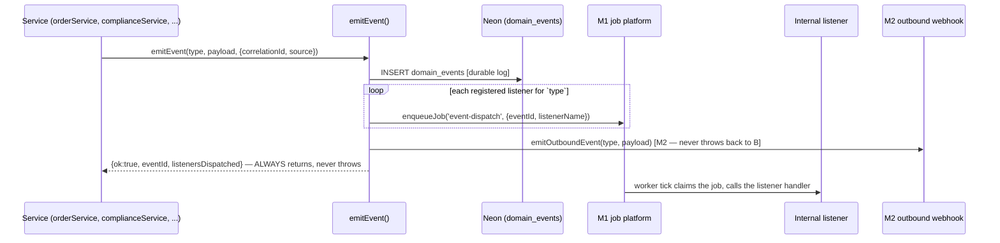

# Event Bus (Phase 4 — Milestone 4)

Moves the platform toward event-driven architecture without a rewrite: a domain event is
durably logged, then fanned out to internal listeners (via the M1 job platform) and to
subscribed M2 outbound webhooks — the first real trigger source that dormant mechanism has had
since it shipped. Every emission point added this milestone is **additive** — sprinkled
alongside existing, already-tested direct calls (`notifyUser`, `reconcileCompletedOrder`,
`generateDocument`, ...), never replacing them.

Code: [frontend/app/lib/platform/events/](../frontend/app/lib/platform/events/) · Schema:
[sql/neon/015_event_bus.sql](../sql/neon/015_event_bus.sql) · Status:
`GET /api/internal/events/status`

## 1. Architecture



**`emitEvent()` never throws to its caller.** It is called from inside existing, tested
business-logic functions (order transitions, compliance completion, ...) as a side channel, not
the primary operation. A bug or transient failure in the event bus must never be able to break
order submission or compliance completion. Every failure path — unknown type, unserializable
payload, a DB error — is caught internally, logged, and reflected in the returned `{ok:false}`;
callers don't check the result (by design), so they simply proceed unaffected either way. The
outbound-webhook fan-out is wrapped in its *own* nested catch, isolated from the outer one, so a
webhook delivery failure can never undo the fact that the event was already durably recorded
and internal listeners already dispatched.

**The event catalog is a fixed set**, unlike M1 job types or M3 reconciliation types (which are
free-form strings) — `emitEvent` validates against `EVENT_TYPES` and drops anything else. This
is deliberate: the brief named exactly 9 events, and typo-proofing the catalog matters more
here than the flexibility open types give the queue/reconciliation systems. Listener *names*
remain free-form, same as job/comparator names elsewhere in the platform.

## 2. The 9 events

| Event | Fires from | Status |
|---|---|---|
| `InvestorCreated` | `identityService.ensureAccount()` | ✅ wired |
| `ComplianceCompleted` | `complianceService.submitItem()`, any item reaching a `DONE_STATUSES` status (`verified` or `completed` — not just the literal string `'completed'`, since PAN/identity finish via `verified`) | ✅ wired |
| `InvestmentReady` | `complianceService.maybeCompleteInvestmentReady()`, the derived gate | ✅ wired |
| `OrderSubmitted` | `orderService.transition()`, `toStatus === 'submitted'` | ✅ wired |
| `OrderCompleted` | `orderService.transition()`, `toStatus === 'completed'` | ✅ wired |
| `PortfolioUpdated` | `portfolioService.reconcileCompletedOrder()` and `connectMockPortfolio()` (only when holdings actually changed) | ✅ wired |
| `DocumentGenerated` | `documentService.generateDocument()` | ✅ wired |
| `NotificationSent` | `notifications.notifyUser()` — fires for every notification, including ones a listener itself triggers | ✅ wired |
| `AdvisorAssigned` | — | 🔴 **not wired** — no assignment flow exists until Journey 5 (CRM). Registered in the catalog now so that flow only needs an `emitEvent()` call, not new plumbing. |

## 3. The first real internal listener

`InvestmentReady` → `notify-investor`
([listeners/investmentReadyNotification.js](../frontend/app/lib/platform/events/listeners/investmentReadyNotification.js))
sends the user a notification the moment they become investment-ready — genuinely new
behavior, confirmed by reading `complianceService.js` before adding it: nothing there ever
called `notifyUser` for this milestone. `complianceService` only emits the event; it has no
idea this listener (or any other) exists — exactly the decoupling the brief asked for, proven
with real new functionality rather than a contrived example.

## 4. Extension guide

**Adding a new internal listener** (matches the exact pattern M2 providers / M3 comparators use):
```js
import { registerEventListener } from "../registry.js";
registerEventListener("OrderCompleted", "my-listener-name", async (payload, { event }) => {
  // idempotent — at-least-once, same as every other job-platform handler
});
```
Add the import to `listeners/index.js`. That's the whole integration — no changes to
`orderService.js` or any other emitter.

**Adding an outbound webhook subscriber** — insert a `webhook_outbound` row (M2) with
`event_types` containing the event name. No code change needed; `emitEvent` already calls
`emitOutboundEvent` for every emission.

**A future event type** (e.g. once `AdvisorAssigned` gets a real trigger in Journey 5): add one
entry to `EVENT_TYPES` in `core.js` with its description, then call `emitEvent()` from the new
code path. The dispatch/logging/webhook machinery needs no changes.

## 5. Failure modes & recovery

| Failure | Behavior | Recovery |
|---|---|---|
| Unknown event type (typo) | Logged, `{ok:false, reason:'unknown_type'}`, nothing written | Fix the caller; add the type to `EVENT_TYPES` if it's genuinely new |
| Unserializable payload | Caught by the outer try/catch, `{ok:false, reason:'internal_error'}` | Fix the payload shape at the call site |
| A listener handler throws | Its `event-dispatch` job retries/dead-letters per M1 — other listeners for the same event are unaffected (separate jobs) | `requeueDeadJob` after fixing the handler |
| Outbound webhook delivery fails | M2's own retry/backoff; isolated from the emit call's success | Standard M2 recovery (see `docs/WEBHOOK_PLATFORM.md`) |
| The whole emit fails (DB down, etc.) | Caller's business logic is UNAFFECTED — `emitEvent` never throws | Investigate via server logs; the emitting operation itself already succeeded |

## 6. Known operational cost

Every `notifyUser()` call now does one extra `domain_events` INSERT plus one `webhook_outbound`
SELECT (via `emitOutboundEvent`). `notifyUser` is called frequently (order transitions, SIP
creation, document generation, portfolio connect), so this is a real, accepted latency/write
cost of the instrumentation the brief asked for — not hidden, not a bug.

## 7. Verification record (M4)

- 15 tests green (13 real-Neon integration + 2 route): the full mechanism (persistence,
  dispatch-as-job, cross-type isolation, outbound fan-out via a real local HTTP listener,
  unknown-type and unserializable-payload resilience), plus **wiring-regression tests that
  exercise the real service call sites** — `makeInvestmentReadyUser` (the same trusted helper
  every other Journey test relies on) proves `InvestorCreated` fires once,
  `ComplianceCompleted` fires for all 8 items via `DONE_STATUSES` (not a naive
  `==='completed'` check — a bug the tests themselves caught before deploy), `InvestmentReady`
  fires once and its listener's `notifyUser` call is independently verified; a real order driven
  to `completed` proves `OrderSubmitted`/`OrderCompleted`/`PortfolioUpdated`/`DocumentGenerated`
  all fire correctly.
- Full platform suite green after adding this milestone (all prior M1–M3 tests unaffected by
  the additive wiring).
- Test-infra note: `eventBus.test.js` also calls `runWorkerTick()` and joins the M1
  advisory-lock protocol (`testClaimLock.js`) alongside `jobPlatform.test.js` and
  `webhookPlatform.test.js` — see `docs/JOB_PLATFORM.md`'s test-infra notes.
