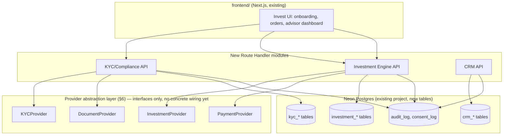
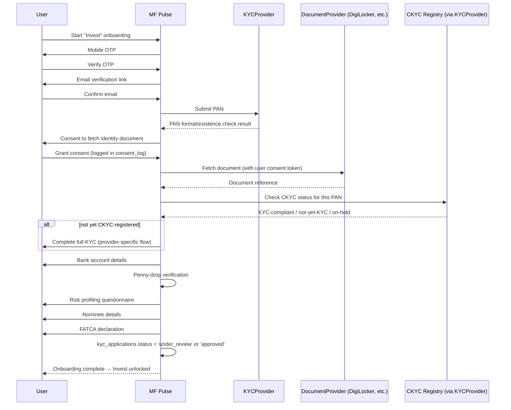
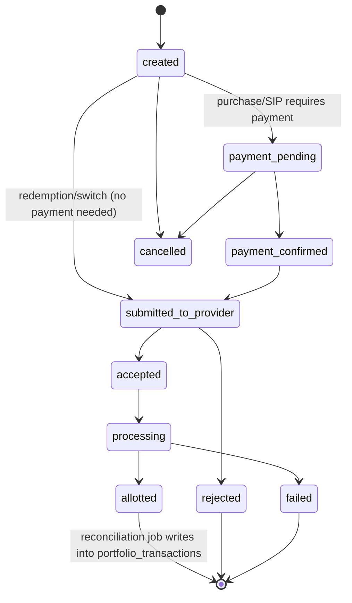

# MF Pulse × Suasion Securities — Invest Platform Architecture

Status: **design and architecture only.** Nothing in this document is wired to a real KYC
Registration Agency, CDSL, BSE Star MF, CAMS, KFintech, or any bank/payment provider. No code in
this repo collects real PAN, Aadhaar, or bank account data, and none moves real money. This
document exists to design the target architecture *before* any of that begins, per the explicit
scoping decision made when this mission was requested: architecture first, real integrations only
after licensing/compliance prerequisites (§13) are independently confirmed.

Grounded in the actual current state of this repo, not assumed — see §0.

---

## 0. What already exists (don't rebuild this)

MF Pulse today is the **Research** product: public AMFI NAV/scheme data, factsheet-derived
metadata for 973 schemes across 3 AMCs (see `docs/AMC_LAYOUT_CATALOG.md`), news, comparison, and
a CAS-import-based **read-only** portfolio view. Concretely, already live:

- **Auth**: Neon `users`/`accounts`/`sessions`/`verification_tokens` (Auth.js, custom adapter,
  credentials-based, `sql/neon/002_auth_and_user_data.sql`). No `role` column exists yet — every
  current user is an undifferentiated "signed-in researcher."
- **Portfolio (passive)**: `portfolio_holdings`, `portfolio_transactions`, `portfolio_sips`,
  `portfolio_corporate_actions` (`sql/neon/002_auth_and_user_data.sql`,
  `sql/neon/008_persistent_portfolio.sql`) — populated by **CAS import** (Groww/Coin/Kuvera/ET
  Money/manual statement parsing), i.e. reflecting trades that already happened elsewhere. There
  is no order-placement or live-transaction path today.
- **Advisor lead capture**: `advisor_leads` (Supabase, `sql/007_advisor_leads.sql`) — a simple,
  insert-only contact form (name/email/phone/investor_type/interest_area/message/consent), RLS-
  locked so the client-side key can never read submitted leads back. This is the **existing**
  Suasion Securities touchpoint: a soft CTA for human follow-up, not a client pipeline or
  investment execution path. The CRM design in §9 extends this table's role rather than replacing
  it.
- **Audit logging**: `audit_log` (Neon) — generic `action`/`metadata`/`ip_address`/`user_agent`,
  already used for sign-in/sign-up/password-reset events.
- **Deployment integrity & release verification**: already built and production-verified this
  same work session — `production-refresh.yml`'s staged commit→alias→verify pipeline,
  `/api/freshness` (real `VERCEL_GIT_COMMIT_SHA`-based deployment identity), and
  `docs/PRODUCTION_RELEASE_RUNBOOK.md`. The brief's "release verification / deployment integrity"
  security item is **already done** for the Research side and directly reusable as-is for Invest.
- **No existing**: job queue, background worker infrastructure, RBAC/role column, encryption-at-
  rest layer beyond what Neon/Postgres provides by default, or any provider-abstraction interface.
  Said plainly rather than assumed, since the brief asks about "queues" and "event architecture" —
  there is nothing here yet to build on; §4 proposes a minimal starting point, not a rewrite of an
  existing system.

---

## 1. Product structure: Research vs. Invest

```mermaid
flowchart LR
    subgraph Research["Research (existing, free, acquisition engine)"]
        R1[Fund search and compare]
        R2[AI-style deterministic insights]
        R3[AMC / Market Intelligence]
        R4[News and watchlists]
        R5[CAS-import portfolio view]
    end
    subgraph Gate["KYC / Onboarding gate"]
        G1[Identity verification]
        G2[Risk profiling]
        G3[Bank + nominee]
    end
    subgraph Invest["Invest (new, premium)"]
        I1[Purchase / Redeem / Switch]
        I2[SIP / STP / SWP]
        I3[Live portfolio sync]
        I4[Advisor relationship]
    end
    Research -->|"Sign up to invest" CTA| Gate
    Gate -->|KYC complete| Invest
    Invest -.shares fund data & analytics with.-> Research
```



Research stays open, unauthenticated-friendly, and the acquisition engine — nothing about Invest
should gate or slow it down. Invest is a distinct, additive layer: same user identity (`users`
table), new domains (KYC, orders, CRM) hung off it.

---

## 2. Personas → capability matrix

| Persona | Research | KYC/Onboarding | Invest (transact) | CRM access | Admin |
|---|:-:|:-:|:-:|:-:|:-:|
| Retail investor (first-time) | ✅ | ✅ (guided, education-heavy) | ✅ (post-KYC) | — | — |
| Experienced investor | ✅ | ✅ (streamlined) | ✅ | — | — |
| HNI | ✅ | ✅ + enhanced due diligence | ✅ + advisor-assisted flows | — | — |
| Financial advisor | ✅ (as research tool) | initiates/tracks client KYC | places orders **on behalf of** assigned clients (with consent trail) | ✅ own pipeline | — |
| Suasion Securities admin | ✅ | oversight, exception handling | oversight, reconciliation | ✅ full | ✅ |

Note: "Retail / Experienced / HNI" are **not** distinct auth roles — they're a segmentation
attribute (see `investor_tier` in §5.1), not a permission boundary. The real permission boundary
is `investor` vs `advisor` vs `admin` (§10.1). Modeling tier as a role would be wrong: an HNI
client has more service, not more access than a retail client to *their own* account.

---

## 3. Service architecture

No new microservices are proposed yet — the existing stack (Next.js Route Handlers on Vercel +
Neon Postgres) can carry the KYC and CRM domains at this scale. The **Investment Engine** is
called out separately because order execution has different reliability/latency/idempotency
requirements than a CRUD API, and should be isolated behind a clear boundary even if it initially
runs in the same deployment.



**Background jobs / queues**: order status polling (a purchase order isn't confirmed
synchronously — it settles over hours), KYC status polling (CKYC/CDSL checks are async), and
CRM digest jobs all need a job runner. Nothing like this exists in the repo today (confirmed —
§0). Recommendation: extend the existing GitHub Actions cron pattern
(`production-refresh.yml`'s model) for low-frequency polling (KYC status, order reconciliation
every few minutes is achievable via `workflow_dispatch` + `schedule`), and defer a real queue
(e.g. a Postgres-backed job table with `FOR UPDATE SKIP LOCKED`, which needs no new
infrastructure beyond Neon itself) until order volume actually requires sub-minute latency. Don't
introduce Kafka/SQS/Redis before there's a measured reason to — nothing in the current stack
needs it, and adding one is exactly the kind of speculative infrastructure this repo's own
constraints elsewhere warn against.

---

## 4. Provider abstraction interfaces

Every external dependency is an interface first. Concrete adapters (CDSL, BSE Star MF, CAMS,
KFintech) are **named as target implementations, not built** — writing a real adapter requires
that provider's actual current API contract, which should be pulled from their real integration
docs at build time, not guessed at here.

```typescript
// frontend/app/lib/investment/providers/types.ts (proposed — does not exist yet)

interface KYCProvider {
  initiateVerification(input: KYCInitiationInput): Promise<KYCSession>;
  checkStatus(sessionId: string): Promise<KYCStatus>;
  // CKYC = Central KYC Registry lookup; distinct from a single provider's own verification —
  // every applicant needs a CKYC status check regardless of which document-verification
  // provider is used, per SEBI/AMFI KYC norms.
  checkCKYCStatus(pan: string): Promise<CKYCStatus>;
}

interface DocumentProvider {
  // DigiLocker is a RETRIEVAL assist (fetches a government-issued e-document the user already
  // has), not a KYC verification itself — see §7.1. Kept as its own interface, not folded into
  // KYCProvider, so a future "user uploads a scan instead" path is the same shape, not a
  // special case.
  fetchDocument(userConsentToken: string, docType: DocumentType): Promise<DocumentRef>;
}

interface InvestmentProvider {
  placeOrder(order: OrderRequest): Promise<OrderAck>;
  getOrderStatus(providerOrderId: string): Promise<OrderStatus>;
  cancelOrder(providerOrderId: string): Promise<OrderAck>;
  createSIPMandate(mandate: SIPMandateRequest): Promise<MandateAck>;
}

interface PaymentProvider {
  initiateMandate(input: MandateInput): Promise<MandateRef>; // e.g. NACH/UPI Autopay for SIPs
  initiatePayment(input: PaymentInput): Promise<PaymentRef>;  // one-time purchase payment
  getPaymentStatus(ref: string): Promise<PaymentStatus>;
}

interface PortfolioProvider {
  // Reconciliation against the EXISTING CAS-import engine (portfolio_holdings/_transactions) —
  // an order placed through InvestmentProvider should settle into the same tables a CAS import
  // would produce, not a parallel "live" portfolio view. One portfolio truth, two ways to
  // populate it (import vs. live order), same downstream analytics engine.
  syncHoldings(userId: string): Promise<void>;
}
```

Business logic (route handlers, CRM logic, portfolio analytics) depends only on these interfaces.
A `MockKYCProvider` / `MockInvestmentProvider` (returning realistic-shaped fake data, clearly
labeled as mocks) is the right next step for building and testing the UI end-to-end *before* any
real provider agreement exists — never fabricate real-looking responses from a provider that
isn't actually wired, and never let a mock provider run outside a clearly-labeled dev/test mode.

---

## 5. Proposed database schema

**Not applied. Not a numbered `sql/neon/` migration file** — deliberately kept as reference DDL
in this document rather than a ready-to-run migration, so it can't be mistaken for something
already reviewed and safe to apply. When implementation actually begins, review against the
chosen providers' real requirements first (field names/formats KYC providers expect, CDSL's
actual demat account number format, etc.), then promote to `sql/neon/009_invest_platform.sql` (or
split further) following this repo's existing conventions (`sql/neon/002_auth_and_user_data.sql`'s
own header comment is the pattern to follow: explain deliberate choices inline).

### 5.1 KYC & Compliance

```sql
-- Extends users, does not replace it. investor_tier is segmentation (§2), not a permission role.
alter table users add column investor_tier text; -- 'retail' | 'experienced' | 'hni', nullable until first assessed
alter table users add column role text not null default 'investor'; -- 'investor' | 'advisor' | 'admin' — see §10.1

create table kyc_applications (
  id uuid primary key default gen_random_uuid(),
  user_id uuid not null references users(id) on delete cascade,
  status text not null default 'not_started',
  -- 'not_started' | 'mobile_verified' | 'email_verified' | 'pan_verified' | 'identity_verified'
  -- | 'ckyc_checked' | 'bank_verified' | 'risk_profiled' | 'nominee_added' | 'fatca_declared'
  -- | 'under_review' | 'approved' | 'rejected'
  pan_masked text,          -- last 4 chars only; full PAN never stored outside the provider's own system if avoidable
  ckyc_number text,
  ckyc_status text,         -- from KYCProvider.checkCKYCStatus
  risk_profile text,        -- 'conservative' | 'moderate' | 'aggressive', from a risk questionnaire (not built here)
  fatca_declared boolean not null default false,
  rejection_reason text,
  created_at timestamptz not null default now(),
  updated_at timestamptz not null default now(),
  unique (user_id)
);

-- One row per verification step attempted, regardless of provider — the audit trail a regulator
-- or internal compliance review would actually need, independent of which provider handled it.
create table kyc_verification_events (
  id uuid primary key default gen_random_uuid(),
  application_id uuid not null references kyc_applications(id) on delete cascade,
  step text not null,          -- 'mobile_otp' | 'email_otp' | 'pan_check' | 'digilocker_fetch' | 'ckyc_check' | 'bank_penny_drop' | 'risk_quiz' | 'fatca'
  provider text,                -- which concrete provider handled this step, once one exists
  result text not null,         -- 'success' | 'failed' | 'pending'
  provider_reference text,      -- opaque id from the provider, for support/reconciliation
  created_at timestamptz not null default now()
);
create index idx_kyc_events_app on kyc_verification_events (application_id, created_at desc);

create table kyc_documents (
  id uuid primary key default gen_random_uuid(),
  application_id uuid not null references kyc_applications(id) on delete cascade,
  doc_type text not null,       -- 'pan_card' | 'aadhaar_masked' | 'address_proof' | 'bank_proof' | 'photo'
  source text not null,         -- 'digilocker' | 'upload' | 'provider_fetch'
  storage_ref text not null,    -- pointer into encrypted object storage, never the raw document in this table
  verified boolean not null default false,
  created_at timestamptz not null default now()
);

create table nominees (
  id uuid primary key default gen_random_uuid(),
  user_id uuid not null references users(id) on delete cascade,
  name text not null,
  relationship text not null,
  allocation_pct numeric not null check (allocation_pct > 0 and allocation_pct <= 100),
  pan_masked text,
  minor boolean not null default false,
  guardian_name text,           -- required if minor
  created_at timestamptz not null default now()
);
create index idx_nominees_user on nominees (user_id);

create table bank_accounts (
  id uuid primary key default gen_random_uuid(),
  user_id uuid not null references users(id) on delete cascade,
  account_number_masked text not null,  -- last 4 digits only
  ifsc text not null,
  account_holder_name text not null,
  verification_method text,      -- 'penny_drop' | 'bank_statement'
  verified boolean not null default false,
  is_primary boolean not null default true,
  created_at timestamptz not null default now()
);
create index idx_bank_accounts_user on bank_accounts (user_id);

-- Explicit, timestamped consent — a regulatory requirement, not a nice-to-have. Every consent-
-- gated action (KYC data sharing, DigiLocker fetch, FATCA declaration, order placement on a
-- client's behalf by an advisor) gets its own row here, separate from the generic audit_log,
-- because consent records need their own retention/immutability guarantees.
create table consent_log (
  id uuid primary key default gen_random_uuid(),
  user_id uuid not null references users(id) on delete cascade,
  consent_type text not null,    -- 'kyc_data_share' | 'digilocker_fetch' | 'fatca_declaration' | 'advisor_order_authority' | 'data_processing'
  granted boolean not null,
  ip_address text,
  user_agent text,
  created_at timestamptz not null default now()
);
create index idx_consent_user_type on consent_log (user_id, consent_type, created_at desc);
```

### 5.2 Investment Engine

```sql
-- Distinct from portfolio_transactions (existing, CAS-derived/already-settled). This table is
-- the LIVE order lifecycle — pending until it settles, at which point a reconciliation job
-- writes the settled result into portfolio_transactions, so downstream analytics
-- (fundHealth, overlap engine, exposure engine — all existing) reads one consistent table
-- regardless of whether a holding came from an import or a live order.
create table investment_orders (
  id uuid primary key default gen_random_uuid(),
  user_id uuid not null references users(id) on delete cascade,
  placed_by_user_id uuid references users(id), -- advisor, if placed on the client's behalf; null if self-directed
  scheme_code text not null,
  order_type text not null,      -- 'purchase' | 'redemption' | 'switch_in' | 'switch_out'
  amount numeric,                 -- for purchase/redemption by amount
  units numeric,                  -- for redemption/switch by units
  status text not null default 'created',
  -- 'created' | 'payment_pending' | 'payment_confirmed' | 'submitted_to_provider'
  -- | 'accepted' | 'processing' | 'allotted' | 'rejected' | 'failed' | 'cancelled'
  provider text,                  -- 'bse_star_mf' | 'cams' | 'kfintech', once wired
  provider_order_id text,
  folio_number text,
  rejection_reason text,
  created_at timestamptz not null default now(),
  updated_at timestamptz not null default now()
);
create index idx_orders_user_status on investment_orders (user_id, status);
create index idx_orders_provider_ref on investment_orders (provider, provider_order_id);

create table sip_mandates (
  id uuid primary key default gen_random_uuid(),
  user_id uuid not null references users(id) on delete cascade,
  scheme_code text not null,
  amount numeric not null,
  frequency text not null,        -- 'monthly' | 'weekly' | 'quarterly'
  start_date date not null,
  end_date date,                   -- null = until cancelled
  mandate_status text not null default 'pending', -- 'pending' | 'active' | 'paused' | 'cancelled' | 'expired'
  payment_mandate_ref text,        -- from PaymentProvider (NACH/UPI Autopay reference)
  provider text,
  created_at timestamptz not null default now(),
  updated_at timestamptz not null default now()
);
create index idx_sip_mandates_user on sip_mandates (user_id, mandate_status);

create table stp_swp_instructions (
  id uuid primary key default gen_random_uuid(),
  user_id uuid not null references users(id) on delete cascade,
  instruction_type text not null,  -- 'stp' | 'swp'
  source_scheme_code text not null,
  target_scheme_code text,          -- required for stp, null for swp (which pays out, not switches)
  amount numeric not null,
  frequency text not null,
  start_date date not null,
  end_date date,
  status text not null default 'active',
  created_at timestamptz not null default now()
);
create index idx_stp_swp_user on stp_swp_instructions (user_id, status);
```

### 5.3 CRM

```sql
-- Extends the existing advisor_leads funnel rather than replacing it — a lead that converts
-- gets a row here, linked back to its origin, so the top-of-funnel source is never lost.
create table advisors (
  id uuid primary key default gen_random_uuid(),
  user_id uuid not null references users(id) on delete cascade, -- advisor's own login is a `users` row with role='advisor'
  employee_code text,
  specialization text,
  active boolean not null default true,
  created_at timestamptz not null default now(),
  unique (user_id)
);

create table advisor_clients (
  id uuid primary key default gen_random_uuid(),
  advisor_id uuid not null references advisors(id) on delete cascade,
  client_user_id uuid not null references users(id) on delete cascade,
  source_lead_id bigint references advisor_leads(id), -- traceable back to the original CTA submission, if any
  pipeline_stage text not null default 'new',
  -- 'new' | 'contacted' | 'kyc_in_progress' | 'onboarded' | 'active_client' | 'dormant' | 'lost'
  assigned_at timestamptz not null default now(),
  updated_at timestamptz not null default now(),
  unique (client_user_id) -- one primary advisor per client; revisit if co-advised accounts are ever needed
);
create index idx_advisor_clients_advisor on advisor_clients (advisor_id, pipeline_stage);

create table advisor_tasks (
  id uuid primary key default gen_random_uuid(),
  advisor_id uuid not null references advisors(id) on delete cascade,
  client_user_id uuid references users(id) on delete set null,
  title text not null,
  due_date date,
  status text not null default 'open', -- 'open' | 'done' | 'snoozed'
  created_at timestamptz not null default now()
);
create index idx_advisor_tasks_advisor_status on advisor_tasks (advisor_id, status);

create table advisor_communications (
  id uuid primary key default gen_random_uuid(),
  advisor_id uuid not null references advisors(id) on delete cascade,
  client_user_id uuid not null references users(id) on delete cascade,
  channel text not null,   -- 'call' | 'email' | 'meeting' | 'whatsapp'
  summary text not null,
  occurred_at timestamptz not null default now(),
  created_at timestamptz not null default now()
);
create index idx_advisor_comms_client on advisor_communications (client_user_id, occurred_at desc);
```

---

## 6. Compliance workflows

### 6.1 DigiLocker's actual role (explicit, per the brief's own caution)

DigiLocker lets a user fetch a government-issued e-document (e.g. an e-Aadhaar XML or a digitally
signed PAN card image) they've already linked to their DigiLocker account. It is a **retrieval
convenience**, not a KYC verification method in itself, and not a substitute for whatever
regulatory KYC process applies (SEBI/AMFI's KYC norms, typically satisfied via a SEBI-registered
KYC Registration Agency / the CKYC registry). The document it retrieves still has to go through
the same verification, CKYC cross-check, and record-keeping as a manually uploaded document. This
is why `DocumentProvider` (retrieval) and `KYCProvider` (verification, CKYC check) are separate
interfaces in §4 — collapsing them would misrepresent "fetched via DigiLocker" as "verified."

### 6.2 Onboarding sequence



Every arrow that touches user data writes a `kyc_verification_events` row; every consent-gated
step writes a `consent_log` row first. No step here is implemented — this is the sequence the
route handlers in `KYC/Compliance API` (§3) should follow once real providers are chosen.

---

## 7. Investment Engine: order lifecycle



The reconciliation step (`allotted` → write into `portfolio_transactions`) is the join point with
the **existing** CAS-import portfolio engine — `fundHealth`, the overlap engine, and the exposure
engine (all already built, `docs/DATA_INVENTORY.md` / prior Portfolio Intelligence phases) should
never need to know whether a holding came from a live order or an imported statement.

---

## 8. CRM backend

Advisor-facing surfaces (dashboard, client pipeline, task list, AUM-per-advisor analytics) read
from §5.3's tables and reuse the **existing** portfolio analytics engines for the "AUM analytics"
requirement — an advisor's book-level AUM is just a sum over their assigned clients'
`portfolio_holdings`/`investment_orders`, not a new computation engine. `advisor_leads` (existing,
Supabase) remains the public-facing capture point; a (not-yet-built) sync job would create an
`advisor_clients` row once a lead is assigned to a specific advisor, preserving the link via
`source_lead_id`.

---

## 9. Security & RBAC

### 9.1 Role model

Three roles on `users.role`: `investor` (default), `advisor`, `admin`. Every new route handler
in the KYC/Investment/CRM APIs must check `role` server-side from the session (same discipline
`sql/neon/002_auth_and_user_data.sql`'s own header already establishes for `user_id` — never
trust a client-supplied role or user id). An `advisor` may only read/act on clients in their own
`advisor_clients` rows; an `admin` bypasses that scope. This needs no new infrastructure — it's a
`where` clause discipline, same as the existing auth model.

### 9.2 PII handling

PAN, Aadhaar, and bank account numbers are **never stored in full** in application tables per
this design — `kyc_applications`/`bank_accounts` store masked values (`pan_masked`,
`account_number_masked`) and an opaque `storage_ref`/`provider_reference` pointing at whichever
provider or encrypted object store holds the real value. This isn't a implementation detail to
defer — it's a design constraint that shapes the schema in §5, and should be a hard requirement
of whatever concrete providers are eventually chosen (many KYC/CDSL providers are designed to be
the system of record for the sensitive document itself, precisely so consuming applications don't
have to be).

### 9.3 Encryption, sessions, audit — what to reuse vs. add

- **Sessions**: Auth.js's existing `sessions` table and route-handler session-derivation pattern
  extends unchanged; `role` just becomes another field read off the session.
- **Audit**: `audit_log` (existing) gets new `action` values (`'kyc_step_completed'`,
  `'order_placed'`, `'advisor_client_assigned'`, etc.) rather than a parallel table — consistent
  with how it's already structured (generic `action`/`metadata` columns, not action-specific
  tables).
- **Consent**: `consent_log` (§5.1, new) — deliberately separate from `audit_log`, since
  consent records likely need different retention/immutability rules than general audit events,
  and conflating them would make a future compliance query ("show every consent this user ever
  granted") a fragile `metadata->>'type'` filter instead of a real table.
- **Encryption at rest**: Neon encrypts at rest by default; no new column-level encryption is
  designed here because no full sensitive value (raw PAN/Aadhaar/account number) is meant to
  live in these tables per §9.2 — if a future concrete integration requires storing a real
  encrypted value application-side, that's a deliberate, separate decision to make then, not a
  gap to silently fill now with a guessed-at encryption scheme.
- **Deployment integrity / release verification**: already fully built for the whole platform
  (`production-refresh.yml`, `/api/freshness`, `docs/PRODUCTION_RELEASE_RUNBOOK.md`) — extends to
  Invest with zero new work, since it operates at the deployment level, not per-feature.

---

## 10. Performance & monitoring

Reuse existing patterns rather than building parallel ones: `/internal/system-health` and
`pipelineHealth.js` already establish the "one shared health-check surface" pattern this repo
uses — a future `/internal/invest-health` (order queue depth, KYC pending count, provider error
rate) should follow the same shape, not invent a new one. No caching strategy is proposed here
beyond what's already standard in the Next.js App Router (route-level `revalidate`) — order and
KYC status are inherently per-user, low-traffic-per-record data, not the kind of shared,
cacheable content the existing `revalidate: 900`-style patterns exist for.

---

## 11. Explicit non-goals of this document

- No real provider credentials, sandbox or production, are referenced or required to read this
  document.
- No code exists yet in this repo implementing any interface in §4 — not even a mock.
- No schema in §5 has been applied to Neon. `\dt` against production today shows none of these
  tables.
- No claim is made here that DigiLocker, or any specific provider, satisfies a specific
  regulatory requirement — that determination belongs to whoever holds the actual SEBI/AMFI/CDSL
  registration and legal counsel, not to this architecture document.

## 12. What has to be true before any of §4-§9 gets implemented for real

1. **Confirm Suasion Securities' actual regulatory status** — SEBI registration category
   (Investment Adviser, Mutual Fund Distributor via AMFI ARN, or stock broker with CDSL DP
   status), since that determines which flows are even legally available (e.g., an MFD can
   facilitate purchases but has different obligations than an RIA).
2. **Provider agreements** — real sandbox/UAT credentials from whichever of CDSL/BSE Star
   MF/CAMS/KFintech is chosen, and their actual current API documentation (this document's
   interfaces are provider-agnostic by design specifically so the real contract can be reviewed
   later without redesigning the abstraction).
3. **Data protection review** — India's DPDP Act 2023 obligations for PAN/Aadhaar-adjacent data,
   likely requiring a formal Data Protection Impact Assessment before real PII ever reaches this
   system, independent of anything designed above.
4. **Independent security audit** of the KYC/Investment/CRM design once schema and interfaces are
   finalized, before real user data or real orders touch it.
5. **Sandbox integration testing** against real (non-production) provider environments before any
   real money moves.

## 13. Suggested next steps, in order

1. Detail the KYC onboarding flow further (exact fields, exact provider once chosen) — still
   design-only.
2. Review and refine §5's schema against the actual chosen providers' real data shapes.
3. Build `MockKYCProvider`/`MockInvestmentProvider`/`MockPaymentProvider` and the Invest UI against
   them, clearly labeled as mocks, so the product experience can be validated before any real
   integration exists.
4. Only after §12's prerequisites are independently confirmed: implement one real provider adapter
   per interface, starting in a sandbox environment.
