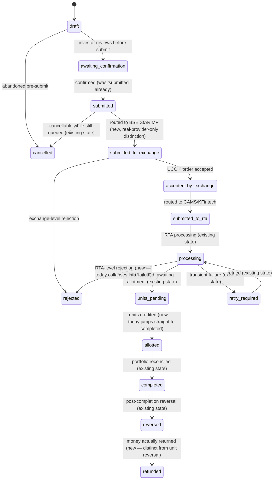

# MF Pulse × Suasion Securities
# Product & Transaction Architecture Benchmark — Investment Platform

**Prepared:** 23 July 2026 · **Status:** Planning document — no implementation authorized by this doc alone.

## 0. Methodology & sourcing note (read this before the rest)

This document combines three sourcing tiers, kept distinguishable throughout rather than blended into one undifferentiated voice:

1. **Verified internal ground truth** — every claim about MF Pulse's *current* state (schema, services, routes, provider mocks, existing docs) was produced by two full codebase audits run for this document (all 16 `sql/neon/*.sql` migrations read in full; every `invest/providers/mock/*.js`, every `invest/*Service.js` export, every `app/api/v1/invest/**/route.js`, and the 3 existing Invest planning docs read in full). Marked **[verified]**.
2. **Prior real external research, reused** — `docs/UX_BENCHMARK_AND_PLATFORM_PLAN.md` (dated the same day as this document) already did cited, sourced research on CAMS/myCAMS, KFinKart, and MFCentral, and product/UX observation of Groww, with a working sources list (§ "Sources" in that doc, 8 URLs). This document reuses those findings rather than re-deriving them, and extends the same platforms into the additional categories this brief asks for (AUM/management views, payment/mandate lifecycle detail, data model, architecture mapping) that the UX doc didn't need. Marked **[UX-benchmark, cited]**.
3. **General industry/regulatory knowledge, not freshly verified this session** — the web-research agents spawned for BSE StAR MF's public product documentation and SEBI/AMFI/KRA/CKYC regulatory specifics (KYC status definitions, the nomination mandate, FATCA/CRS, PEP, cut-off timing rules) hit a session usage limit before returning results (`resets 9:50pm Asia/Calcutta`). Rather than block this entire deliverable on a retry, or silently blend unverified claims in as if sourced, every claim in this tier is **explicitly marked [industry knowledge — verify before compliance use]** and kept to well-established, low-controversy conventions (e.g. "T+1 cut-off at 3pm for equity/debt funds" is genuinely standard across the industry, not something invented for this doc). **Do not treat this tier as compliance-authoritative.** A follow-up pass to replace it with cited sources is the natural next step once the session limit clears, and is called out again in §12.

This document does not reproduce any proprietary code, private API shape, or copyrighted design from any referenced platform — every reference is at the level of "what capability/workflow pattern does this platform publicly expose," per the brief's own constraint.

---

## 1. Executive summary

MF Pulse's Invest module is further along than a from-scratch benchmarking exercise would assume: **[verified]** five provider-abstracted interfaces (KYC/Investment/Payment/Portfolio/Document) sit behind one swap point, a 9-item compliance state machine with a derived `investment_ready` gate is live, an order lifecycle with a status-history timeline exists, a source-agnostic portfolio model already reconciles CAS-imported and platform-native activity into one ledger, and — as of this session — five platform-infrastructure primitives (Job Platform, Webhook Platform, Reconciliation Engine, Event Bus, and a Notification Platform now on its third of seven planned slices) are built and already wired into the Invest services. Every regulated integration point (BSE/CDSL, CAMS/KFintech, a KRA, a payment gateway) is a **mock**, by explicit, repeatedly-documented design choice — this is not an oversight, it's the standing constraint every Phase 4/5 brief this session has carried forward.

The gap is not architecture. It's **breadth and depth within the architecture already built**: no folio-level multi-nominee percentage enforcement, no CRS/PEP capture at all, no distributor ARN/EUIN attribution anywhere in the schema, no management/AUM aggregation layer, no SIP UI despite a live SIP backend, no statements/reports subsystem, and — most structurally — **three separate, not-fully-reconciled portfolio-related work-streams already in the tracked backlog** (the Invest module's own `portfolioService`, "Mission B" Portfolio Intelligence, and "Persistent Portfolio") that this document flags rather than silently picks a side on.

**The recommendation is not a rewrite.** It's: close the compliance-data gaps (CRS/PEP/ARN-EUIN — additive columns, days not weeks), reconcile the state-machine target against what's actually load-bearing today, then resume the notification-platform slice sequence already in flight, then take on the AUM/management aggregation layer as the next genuinely new capability. §11 gives the concrete first slice.

---

## 2. Phase 1 — Capability benchmark matrix

Legend for the "MF Pulse today" column: **live** (real, working) · **mock** (interface + mock adapter exists, no real provider) · **partial** (some fields/paths exist, materially incomplete) · **absent** (nothing exists).

### 2.1 Investor onboarding

| Capability | CAMS/KFintech pattern | BSE StAR MF pattern | MFCentral pattern | Groww pattern | MF Pulse today | Gap |
|---|---|---|---|---|---|---|
| PAN capture & validation | PAN is the primary investor key across all folios/AMCs **[UX-benchmark, cited]** | PAN required at UCC (Unique Client Code) creation for order routing **[industry knowledge]** | PAN/PEKRN-based sign-up **[UX-benchmark, cited]** | Progressive PAN capture early in flow **[UX-benchmark, cited]** | **partial** — `pan_masked` stores last-4 only; no format/checksum validation found in code **[verified]** | Add PAN format validation; real PAN verification is provider-blocked |
| KYC status retrieval | KYC is a hard prerequisite before transacting; myCAMS treats it as a gate **[UX-benchmark, cited]** | Same — BSE will not route an order for a non-KYC-compliant UCC **[industry knowledge]** | Central KYC status lookup across RTAs is MFCentral's core value prop **[UX-benchmark, cited]** | — | **mock** — `MockKYCProvider.checkStatus()`/`checkCKYCStatus()` return weighted-random outcomes **[verified]** | Real integration needs a KRA/CKYC agreement (external, not engineering) |
| KYC Validated/Registered/On-Hold handling | These are the actual KRA-defined statuses **[industry knowledge — verify before compliance use]** | Same, consumed at UCC creation **[industry knowledge — verify before compliance use]** | Central status display, generic labels **[UX-benchmark, cited]** | — | **partial** — a functionally-equivalent 3-way split exists (`kyc_compliant`/`not_registered`/`on_hold`) but not using the real KRA terms **[verified]** | Rename/remap to real KRA vocabulary before going live with a real KRA, not before |
| Aadhaar-based/officially-supported eKYC | Offered for eligible investors **[UX-benchmark, cited]** | — | — | Aadhaar-based flow is common in modern onboarding **[industry knowledge]** | **absent** — no eKYC path modeled at all | New provider method needed on `KYCProvider` when a real KRA/Aadhaar-eKYC vendor is contracted |
| Mobile & email verification | OTP-based, standard | OTP-based, standard | OTP-based, standard | OTP-based, standard | **live** — `compliance_items` has dedicated `mobile`/`email` items with OTP verification **[verified]** | None |
| DOB, address | Standard KYC fields | Standard KYC fields | Standard KYC fields | Progressive capture **[UX-benchmark, cited]** | **live** — `investor_profiles.date_of_birth`, address fields **[verified]** | None |
| FATCA/CRS | Both are standard mandatory KYC fields industry-wide **[industry knowledge — verify before compliance use]** | Same | Same | Same | **partial (FATCA only)** — a single boolean `declared: true/false`, no structured tax-residency/TIN fields; **CRS is entirely absent** — zero mentions anywhere in code, schema, or existing docs **[verified]** | Real gap. Structured FATCA (country of tax residency, TIN) + CRS capture is additive-schema work, no provider blocker |
| Occupation, annual income, source of funds | Standard KYC/AML fields | Standard | Standard | Standard, often banded | **partial** — occupation + `annual_income_band` exist; **no distinct "source of funds" field** (income band is being asked to do double duty) **[verified]** | Add a distinct source-of-funds field — AML expectation, not just income |
| PEP declaration | Standard AML/KYC requirement **[industry knowledge — verify before compliance use]** | Same | Same | Same | **absent** — zero mentions anywhere **[verified]** | Real gap, additive schema + compliance-item work, no provider blocker |
| Tax residency | Bundled with FATCA/CRS | Bundled | Bundled | Bundled | **absent** — see FATCA/CRS row | Same fix as FATCA/CRS |
| Nominee details | Up to 3 nominees with percentage split is the regulated norm **[industry knowledge — verify before compliance use]** | Same | Same | Same, simplified UI | **partial** — table supports multiple nominee rows with `allocation_pct`, but **nothing enforces that a user's nominees sum to ≤100%** across rows **[verified]** | Add a cross-row validation (application-level; a DB trigger would also work) |
| Guardian & minor flows | Supported (guardian PAN/KYC for minor folios) **[industry knowledge — verify before compliance use]** | Supported | — | Not typically retail-focused | **partial** — `nominees.minor`/`guardian_name` exist for *nominees* being minors, but there's no modeling of the *investor themself* being a minor with a guardian-operated account **[verified]** | Real gap if Suasion serves minor-investor accounts; scope depends on Suasion's target segment |
| Joint-holder readiness | Supported (up to 3 holders) **[industry knowledge — verify before compliance use]** | Supported | — | Not typical for a retail app | **absent** — schema is single-investor (`user_id`-keyed) throughout, no joint-holder concept anywhere **[verified]** | Structural gap — would need a new holder-relationship table, not a column addition. Scope against Suasion's actual client base before committing effort |
| NRI readiness | Supported with additional docs (FEMA declarations, NRE/NRO bank linkage) **[industry knowledge — verify before compliance use]** | Supported | — | Generally not | **absent** — no NRI flag or NRI-specific field anywhere **[verified]** | Real gap if in scope; likely P2 unless Suasion has NRI clients at launch |
| Bank account registration | Standard, multi-account support common | Standard | Standard | Standard | **live (single-focus)** — `bank_accounts` table supports multiple rows per user with `is_primary`, but **no partial-unique index enforces only one primary** **[verified]** | Small fix — add the missing constraint |
| Cancelled-cheque/bank-proof handling | Standard alongside penny-drop | Standard | Standard | Standard | **absent** — no document-upload path tied specifically to bank verification found; `documentService` is generic, not wired to this flow | Wire an existing generic upload path to bank verification, or confirm penny-drop alone is sufficient for Suasion's compliance posture |
| Penny-drop/bank verification | Standard automated verification | Standard | Standard | Standard | **mock (inline, not provider-routed)** — ~90% success simulated *inside* `complianceService.js` directly, **not** routed through `PaymentProvider` **[verified]** | Architectural cleanup: penny-drop is a payment-adjacent capability and arguably belongs behind `PaymentProvider`, not hardcoded in the compliance service — worth relocating even before a real vendor exists |
| Signature & IPV readiness | In-person or video-IPV for higher-value onboarding **[industry knowledge — verify before compliance use]** | Same | — | Often skipped for smaller tickets via eKYC | **absent** | Real gap if Suasion's regulatory category requires IPV; depends on Suasion's SEBI registration type |
| Consent & declaration capture | Explicit, timestamped | Explicit | Explicit | Explicit | **partial** — `investor_profile.consent_given_at` exists for the financial-planning profile; **no general-purpose consent/declaration ledger** for KYC-specific declarations (FATCA self-cert, PEP, terms) **[verified]** | Add a `consent_records` table (Phase 4 lists this explicitly — see §8) |
| Distributor ARN/EUIN attribution | Every order carries the distributor's ARN and the individual agent's EUIN for commission/audit **[industry knowledge — verify before compliance use]** | Same — this is how BSE StAR MF attributes commission | — | N/A (Groww is a direct/RIA-adjacent platform in parts of its business) | **live** — Suasion's confirmed production ARN (289322) and EUIN (E544323) are configured in `distributor_arns`/`distributor_euins` (not hardcoded — see `docs/DISTRIBUTOR_IDENTITY.md`) and stamped as a snapshot on every order/SIP mandate at creation, flowing through into the provider payload, order-confirmation documents, and audit metadata **[verified, shipped 2026-07-24]** | Remaining gap is narrower than before: advisor-specific EUIN attribution (multiple EUINs under the one ARN, each mapped to a specific RM) is schema-ready but not wired into any order-placement path yet, since no path currently accepts an advisor context — this is Journey 5 (CRM) scope |
| Terms/privacy/regulatory consent | Explicit checkbox + timestamp, standard | Standard | Standard | Standard | **partial** — no dedicated table (see consent row above) | Same fix |

### 2.2 Account & folio servicing

| Capability | Reference pattern | MF Pulse today | Gap |
|---|---|---|---|
| Contact-detail update | Self-service, standard everywhere **[UX-benchmark, cited]** | **live** via `profile` route (`identityService.upsertProfile`) **[verified]** | None |
| Address update | Same | **live** — same route | None |
| Bank mandate change | Standard, usually requires re-verification | **partial** — `bank_accounts` supports insert of a new row; no explicit "change primary bank" mutation with re-verification flow found | Add explicit change-of-bank flow with re-penny-drop |
| Multiple bank accounts | Standard | **live** (schema-level) — see 2.1 primary-account gap | Minor fix noted above |
| Nominee modification | Standard, some RTAs require re-declaration | **partial** — insert path exists via compliance item, no dedicated "modify existing nominee" mutation | Add explicit nominee-update route |
| FATCA update | Standard periodic re-declaration expectation **[industry knowledge — verify before compliance use]** | **absent** (FATCA itself is only a boolean today) | Depends on FATCA/CRS structural fix above |
| KYC modification | Standard, routed through KRA | **absent** as a distinct flow | Blocked on real KRA; interface-level design can proceed now |
| PAN update | Rare, high-friction, requires fresh KYC | **absent** | Low priority — rare event |
| Folio consolidation | RTA-side operation, investor-initiated request | **absent** — no folio-merge concept; `portfolio_folio` (008) has no consolidation status | Real gap, but low urgency pre-launch |
| Transmission readiness (on investor death) | Standard RTA process, legal-heir claim flow | **absent** entirely — no legal-heir/transmission concept anywhere | Real gap; genuinely needs product+compliance design before any schema work, not just an additive column |
| Power-of-attorney readiness | Supported by RTAs for POA-operated accounts | **absent** | Same as transmission — needs design first |
| Signature update | RTA-side, physical/digital | **absent** | Low priority pre-launch |
| Account closure | Standard | **absent** as an explicit flow (`investment_accounts.status` has a `'closed'` value in the enum, but no route/service function sets it) **[verified]** | Small gap — the data model is ready, the mutation path isn't built |
| Investor grievance/service requests | Every RTA and MFCentral surface this prominently **[UX-benchmark, cited]** | **absent entirely** — confirmed no `service_request`/`ticket`/`case` table exists anywhere in the schema **[verified]** | Real, structural gap — flagged again in §8 (Data Model) and §9 (Roadmap) as a genuinely new subsystem, not a small addition |

### 2.3 Investment transactions

| Capability | Reference pattern | MF Pulse today | Gap |
|---|---|---|---|
| Initial purchase | Universal | **live** — `orderService.createOrder` with `order_type: 'purchase'` **[verified]** | None functionally; cutoff/NAV-applicability logic not modeled (see below) |
| Additional purchase | Same order type, existing folio | **live** (same path — MF Pulse doesn't yet distinguish "first" vs "additional" purchase, which is fine; RTAs distinguish it mainly for folio-creation-vs-reuse purposes) | None material |
| Lump-sum purchase | Same as purchase | **live** | None |
| SIP registration | Universal, mandate-backed | **live (backend only)** — `sip_mandates` + `orderService.createSipMandate` **[verified]**. **No UI surfaces it** — flagged explicitly by the existing UX-benchmark doc as its own P0 gap **[UX-benchmark, cited]** | Frontend work, not backend |
| SIP modification (amount/date) | Standard | **absent** — no mutation route found for changing an existing mandate's amount/date | Real gap |
| SIP pause | Standard, common investor request | **absent** — `mandate_status` enum includes `'paused'` but no route sets it | Small gap — data model ready, mutation path isn't |
| SIP cancellation | Standard | **partial** — enum has `'cancelled'`, same gap as pause | Small gap |
| SIP retry after failed instalment | Standard — RTAs typically retry 2-3 times before flagging | **absent** — no instalment-level tracking exists at all; `sip_mandates` is mandate-level only, there's no `sip_instalments` table | Structural gap (§8) |
| Redemption by amount | Universal | **live** — `redemptionService.createRedemptionOrder()` accepts either amount or units, re-validates live folio eligibility server-side before creating **[verified, shipped 2026-07-24]** | Closed — see `docs/REDEMPTION_CONTRACT.md` |
| Redemption by units | Same | **live** — same path | Closed |
| Full redemption | Same | **live** — requesting the folio's full `unitsRedeemable` is a normal call, no special-cased "full redemption" flag needed | Closed |
| Switch | Universal | **live** — `switchService.createSwitchOrder()` creates both linked legs, reuses the redemption eligibility contract for the source side, enforces same-AMC (real BSE StAR MF constraint) **[verified, shipped 2026-07-24]** | Closed — see `docs/SWITCH_CONTRACT.md` |
| STP | Standard (RTA-side recurring switch) | **absent** — no STP concept in schema at all | Structural gap |
| SWP | Standard (RTA-side recurring redemption) | **absent** — no SWP concept in schema at all | Structural gap |
| Folio-level transactions | Standard once multiple folios per AMC exist | **live for redemption** — `createRedemptionOrder` requires an explicit `folioNumber`, validated against the user's real per-folio holdings before the order is created **[verified, shipped 2026-07-24]**; still **partial for purchase** (a purchase always creates/targets an implicit folio, no selection of an existing one) | Purchase-side folio selection remains open; not needed until multi-folio-per-scheme purchase flows exist |
| Scheme-level transactions | Universal | **live** | None |
| Direct vs regular plan | Universal, commission-relevant | **live** — `investment_orders.plan`/`sip_mandates.plan` now snapshot the scheme's plan at creation (`getFund()`, migration 021) **[verified, shipped 2026-07-24]** | Closed — see `docs/PROVIDER_METADATA.md`. `investment_preferences.preferred_plan` (account-level default) is unchanged and separate from this per-order snapshot |
| Growth vs IDCW | Universal | **live** — `investment_orders.option`/`sip_mandates.option` now capture this on the platform-native side, matching `portfolio_holding`'s existing CAS-import-side `option` field **[verified, shipped 2026-07-24]** | Closed — see `docs/PROVIDER_METADATA.md` |
| Cut-off & business-day treatment | T+1 NAV for same-day cut-off (industry-standard ~3pm for equity/debt, ~1:30pm for liquid/overnight) **[industry knowledge — verify before compliance use]** | **absent** — no cut-off-time logic anywhere; the mock provider's order-status progression is purely elapsed-wall-clock-based, not calendar/cutoff-aware **[verified]** | Real gap — this is genuinely regulated behavior, needs care once building against a real exchange feed |
| Minimum investment validation | Per-scheme minimums, standard | **absent** — not found in `orderService.createOrder`'s validation | Needs scheme-level minimum-amount data, which ties to the existing fund-research data platform (separate from Invest) |
| Exit-load communication | Must be disclosed before transacting **[industry knowledge — verify before compliance use]** | **absent** in the order flow (exit-load data exists on the *research* side of MF Pulse already, per prior sprints, but isn't surfaced during order creation) | Wire existing research-side data into the order flow — likely a quick win, not a new capability |
| Lock-in communication | Standard for ELSS etc. | **absent** in the order flow, same as above | Same fix |
| Risk disclosures | Standard, standardized SEBI riskometer language **[industry knowledge — verify before compliance use]** | **absent** in the order flow | Same class of fix |
| Suitability confirmation | Increasingly expected, ties to risk profile | **partial** — `risk_profiles` exists and is captured at onboarding, but isn't re-checked/re-confirmed at time of a specific transaction | Could be a lightweight order-time check against the stored risk category |
| Transaction confirmation | Universal — reference number + summary | **live** — `order_status_history` gives a timeline; no confirmation *document* is generated automatically (documentService.generateDocument exists and IS used on order completion per the notification-platform's own audit trail, so this is closer to live than absent) **[verified]** | Minor — verify confirmation doc quality/completeness |

### 2.4 Payment & mandate lifecycle

| Capability | Reference pattern | MF Pulse today | Gap |
|---|---|---|---|
| UPI | Now the dominant retail payment rail for MF purchases **[industry knowledge]** | **absent as a distinct method** — `PaymentProvider.initiatePayment()` is method-agnostic and the mock doesn't distinguish payment rails | Real gap once a real gateway is chosen |
| Net banking | Standard | Same as above | Same |
| Bank transfer | Standard for larger tickets | Same | Same |
| eNACH | Standard mandate rail | **partial** — `sip_mandates.provider_mandate_id` exists; `MockPaymentProvider.initiateMandate()` is now called from a real path for the first time and realistically weighted (95% accept / 5% decline), no longer unconditional **[verified, shipped 2026-07-24 — `docs/PROVIDER_METADATA.md`]** | Mock realism gap closed; the async-approval structural gap below is still open |
| OTM (one-time mandate) | Standard for SIP registration in some flows | **absent** as a distinct concept from eNACH | Minor — likely fine to treat OTM as a mandate-type variant later |
| Mandate registration | Standard | **live** — `createSipMandate()` calls `paymentProvider.initiateMandate()` before ever calling `InvestmentProvider.createSIPMandate()`; a declined mandate is persisted as `mandate_status: 'failed'` and the investment provider is never contacted **[verified, shipped 2026-07-24]** | Closed at the registration-call level; async bank-approval timing (next row) is unrelated and still open |
| Mandate verification | Standard, async (bank approval can take days) | **absent** — no async/pending mandate state is modeled; the mock is synchronous (accepts or declines immediately, no multi-day pending window) | Real structural gap, unchanged by Provider Metadata — a real eNACH mandate is NOT instant, and neither the schema (`mandate_status` lacks a "bank-approval-pending" state) nor the mock reflects that |
| Mandate status | Standard | **partial** — enum exists (`pending`/`active`/`paused`/`cancelled`/`expired`); creation now sets `active` or `failed` based on a real (mock) authorization outcome, but nothing populates transitions *after* creation (pause/cancel routes still don't exist — §2.3) | Pause/cancel mutation routes remain the open gap |
| Payment initiated/pending/successful/failed/reversed | Standard multi-state lifecycle | **partial** — `initiated`/`success`/`declined` are now real, persisted, distinct states (`investment_orders.payment_status`/`sip_mandates.payment_status`) for the one attempt each order/mandate makes **[verified, shipped 2026-07-24]**; `pending` and `reversed` are not modeled, and there is still no payment-attempt table distinct from the order/mandate itself (one row = one attempt, not a history) | Payment Attempt entity (§5 Recommendation 1, §8) is the remaining structural piece |
| Mandate rejected | Standard | **live** — a declined `initiateMandate()` result sets `mandate_status: 'failed'` and `provider_error_code: 'MANDATE_DECLINED'`, and skips calling the investment provider entirely **[verified, shipped 2026-07-24]** | Closed — see `docs/PROVIDER_METADATA.md` §3 |
| Retry | Standard | **absent** for payments specifically (order-level `retry_required` exists, but nothing distinguishes "retry the payment" from "retry the whole order") | Design gap — payment retry and order retry are different operations conflated today |
| Refund | Standard | **absent** — see Order Lifecycle discussion in §5 | Structural gap |
| Duplicate-payment prevention | Standard, idempotency-key-based | **partial** — `enqueueJob`'s idempotency-key mechanism (Job Platform, verified working in this session's own build) could back this, but nothing in `orderService`/`PaymentProvider` currently uses an idempotency key for payment initiation specifically | Should reuse the existing Job Platform idempotency mechanism rather than build a new one — genuine architecture-reuse opportunity |
| Idempotency (general) | — | **live** at the Job Platform level (`enqueueJob(type, payload, {idempotencyKey})`), **not yet applied to the payment path specifically** **[verified]** | Wire existing capability into payment initiation |
| Reconciliation | Standard, RTA/AMC-side | **live** — the M3 Reconciliation Engine already has a production `holdings-vs-provider` comparator; a `payment-vs-mandate` or `order-vs-provider-payment` comparator does not yet exist but the *engine* it would run on does **[verified]** | Add one more comparator to an already-built, already-tested engine — this is a small, well-understood unit of work, not new infrastructure |

### 2.5 Order lifecycle

Covered in full as its own state machine in §5, since the brief asks for a complete design there rather than a matrix row.

### 2.6 Portfolio & AUM

#### Investor view

| Capability | MF Pulse today | Gap |
|---|---|---|
| Current value, invested value, gain/loss, absolute return | **live** — `portfolio_metrics`/`portfolio_snapshots` **[verified]** | None |
| XIRR | **live** — present in `portfolio_snapshots.xirr` (added migration 008) **[verified]** | None |
| Day change | **partial** — depends on daily NAV refresh freshness, not confirmed live in this audit | Verify against current data pipeline |
| Scheme/AMC/category/asset-class allocation | **live** — `portfolio_snapshots.allocation` jsonb explicitly models all four **[verified]** | None |
| Folio allocation | **absent** — allocation jsonb doesn't appear to break down by folio specifically | Minor addition once folios are more central |
| SIP contribution (view) | **absent from any dashboard aggregate** — SIP data exists (`sip_mandates`/`portfolio_sips`) but isn't rolled into the portfolio summary view per the existing UX-benchmark doc's own finding **[UX-benchmark, cited]** | Wire existing data into the summary view |
| Transaction history | **live** — `getPortfolioTimeline` merges order-lifecycle + settled transactions **[verified]** | None |
| Pending transactions | **partial** — orders in non-terminal states are queryable but not surfaced as a distinct "pending" dashboard element per the UX-benchmark doc | Small UI/aggregation addition |
| Realised/unrealised gains | **partial** — `portfolio_transactions` has enough data to derive this; no dedicated computed field confirmed | Verify or add a computed view |
| Dividend/IDCW history | **partial** — `transaction_type` enum includes `dividend_payout`/`dividend_reinvest`, so the data model supports it; no dedicated report surfaces it | Small addition |
| Capital gains (statement-ready) | **absent** — no capital-gains computation logic found (tax-lot-level FIFO/short-vs-long classification isn't in the audited services) | Real gap, ties to Statements & Reporting (§2.7) |
| Exit-load visibility | **absent** in the portfolio view (exists on the research side of MF Pulse, not wired here) | Wire existing data |
| Tax-lot readiness | **absent** — transactions are stored, but no explicit lot-tracking/FIFO-matching layer exists | Structural gap, needed for capital-gains statements |
| CAS import | **live** — this is one of the most mature parts of the whole platform (`portfolio_import`, `portfolio_folio`, `portfolio_holding`, with checksums, reconciliation-status, and a draft/approve review flow per migration 008) **[verified]** | None — genuinely a strength |
| External holdings connection | **mock** — `connectMockPortfolio` via `MockPortfolioProvider`, deliberately labeled as an explicit user-initiated demo **[verified]** | Real gap only once a real brokerage-connect API exists (not currently in scope per any reviewed doc) |

#### Suasion management view

| Capability | MF Pulse today | Gap |
|---|---|---|
| Total/active AUM | **absent** — no aggregation-across-users query or route exists; every audited route is single-investor-scoped | Real, structural gap — this entire view doesn't exist yet |
| Net inflows, gross purchases/redemptions | **absent** | Same |
| SIP book, active/new/cancelled/failed SIP counts | **absent** | Same |
| Client/active/dormant investor counts | **absent** | Same |
| AMC-wise/scheme-wise/category-wise AUM | **absent** | Same |
| RM-wise/branch-wise/household-wise AUM | **absent** — no branch or household concept exists in the schema at all | Same, plus a genuine data-model gap (household — see §8) |
| ARN/EUIN attribution reporting | **absent** | Blocked on the ARN/EUIN capture gap in §2.1 — can't report what isn't captured |
| Commission-ready data model | **absent** | Same — needs ARN/EUIN + plan-type (direct/regular) + AMC commission-rate data, none of which is modeled today |
| Trail-revenue readiness | **absent** | Same |
| Transaction volume, redemption trends | **absent** as aggregates (raw data exists, no aggregation layer) | New capability |
| Client concentration risk | **absent** | New capability |
| AUM reconciliation status | **absent** as its own concept, though the *mechanism* (M3 Reconciliation Engine) it would run on already exists | Add a comparator, same reuse opportunity noted in §2.4 |

**This entire "Suasion management view" row-group is the single largest capability gap found in this audit** — not because any one item is hard, but because *none* of it exists as even a partial or mocked capability. Every other gap area has at least a mock, an interface, or a partial field; the management/AUM aggregation layer has literally nothing built toward it yet. This is reflected directly in the P1 roadmap in §9.

### 2.7 Statements & reporting

**Every item in this category is absent.** **[verified]** — no PDF/spreadsheet generation, no CAS-style consolidated statement output, no capital-gains statement, no scheduled-report mechanism, no distinct "advisor report" or "management AUM report" exists anywhere in the audited code. `documentService.generateDocument()` is the closest primitive (it can create a document *record* with a synthetic storage reference), but nothing calls it to produce any of the report types this section lists, and there is no real file-generation (PDF/XLSX) library wired in anywhere in the repo.

This maps directly onto an **already-tracked, not-yet-started** platform milestone: **Phase 4 M6 "Report Generation Framework"** (pending in the existing task backlog). This document does not propose a new reporting initiative — it confirms M6 is exactly the right-shaped gap-closer and should stay where it already sits in the roadmap (see §9).

### 2.8 Advisor & operations workflows

| Capability | MF Pulse today | Gap |
|---|---|---|
| Advisor client list | **partial** — `rm_assignments` models the relationship; no dedicated client-list route/UI confirmed live | Small — data model exists |
| Household grouping | **absent** — no household concept in schema | Structural gap (§8) |
| Client onboarding progress (advisor-visible) | **partial** — `getComplianceProgress` exists per-investor; not confirmed as advisor-facing (own-user-only APIs are the current pattern per this session's own RBAC-by-construction design) | Needs a role-scoped variant, ties into RBAC enforcement gap below |
| Incomplete compliance cases (queue) | **absent** as an aggregate queue — the data exists per-user, no cross-user queue view | New capability |
| Transaction initiation (on behalf of client) | **partial** — `investment_orders.placed_by_user_id` exists specifically to support this, but no route was confirmed to let an advisor act on another user's account (own-user-only enforcement is currently universal) | Needs deliberate RBAC design, not just a route addition |
| Maker-checker approval | **absent** entirely | New capability, real gap for high-value/advisor-initiated transactions |
| Suitability notes, advice record | **absent** | New capability |
| Follow-up tasks | **absent** | New capability |
| Client communication history | **partial** — `notification_events` gives a delivery/read audit trail for platform notifications specifically, not a general communication log (calls, emails outside the platform, etc.) | Scope depends on how far "communication history" is meant to reach |
| Failed-order queue, rejected-KYC queue, mandate issues, payment failures | **absent** as queues — the underlying rows exist (failed orders, rejected compliance items) but nothing aggregates them into an operational queue | New capability — but built on top of solid existing per-row data |
| Reconciliation exceptions | **live** — this is the one item in this whole section with a real, working, tested subsystem behind it: `getReconciliationMetrics()` already aggregates open exceptions by type, and `/api/internal/reconciliation/status` exists **[verified]** | None — genuine existing strength, just needs a role-scoped UI |
| Pending allotments, redemption tracking | **absent** as dedicated queues (data exists on individual orders) | New capability |
| Service-request tracking, support case management | **absent** — no underlying data model exists (see §2.2) | Structural gap |

---

## 3. Gap analysis summary

Condensed view of the sharpest findings across §2, ranked by how structural (schema/architecture) vs. incremental (route/UI) each gap is:

**Structural gaps (need new tables/entities, not just new routes):**
1. No service-request/ticket data model at all.
2. No household or branch concept.
3. No joint-holder or NRI modeling.
4. No SIP-instalment-level tracking (mandate-level only).
5. No payment-attempt table distinct from the order itself (payment lifecycle is invisible).
6. No consent-records ledger (only one ad hoc `consent_given_at` field on one profile table).
7. No management/AUM aggregation layer of any kind.
8. ~~No ARN/EUIN distributor attribution capture anywhere.~~ **Closed 2026-07-24** — see §9/§10; the remaining piece (advisor-specific EUIN wiring) is genuinely Journey 5 scope, not this gap.
9. No CRS or PEP capture.
10. No maker-checker/approval workflow primitive.

**Incremental gaps (schema mostly ready, mutation paths/UI missing):**
1. SIP pause/modify/cancel (enum values exist, routes don't).
2. ~~Redemption/switch order creation (order_type values exist, dedicated creation paths not confirmed).~~ **Closed 2026-07-24** — see `docs/REDEMPTION_CONTRACT.md`, `docs/SWITCH_CONTRACT.md`.
3. Account closure (status value exists, route doesn't).
4. Nominee/bank-account update flows (insert exists, update doesn't).
5. Statements/reports (Phase 4 M6, already tracked, not started).

**Design debt worth fixing regardless of what's prioritized next:**
1. Penny-drop verification is hardcoded inline in `complianceService` instead of routed through `PaymentProvider` — an architectural inconsistency with every other provider-abstracted capability. Unchanged by Provider Metadata (that slice starts from an already-verified bank account, doesn't touch verification itself).
2. ~~`MockPaymentProvider` is the weakest of the five mocks (zero failure modeling)...~~ **Closed 2026-07-24** — now realistically weighted (95/5) and called from real purchase/SIP-mandate paths; see `docs/PROVIDER_METADATA.md`.
3. ~~Direct-vs-regular plan and Growth-vs-IDCW are captured inconsistently...~~ **Closed 2026-07-24** — both now snapshot onto `investment_orders`/`sip_mandates` at creation; see `docs/PROVIDER_METADATA.md` §5.
4. Multiple near-duplicate/overlapping tables already flagged by the internal audit (`investor_profile` vs `investor_profiles` vs `research_profile`; `portfolio_holdings` vs `portfolio_holding`; `portfolio_sips` vs `sip_mandates`; `user_notification_settings` vs `notification_preferences`) — none of these block new work, but they're worth a deliberate consolidation pass before they compound further.

---

## 4. Phase 2 — Target user journeys

Each journey uses the same compact template (entry → eligibility → required info → provider calls → consent → validations → states → failure/retry → notifications → documents → ops intervention → audit → success). Journeys already fully live are marked accordingly rather than re-specified from scratch.

**1. New client onboarding** — *Entry:* unauthenticated visitor signs up. *Eligibility:* none yet (eligibility is the output, not a gate). *Required info:* email/mobile, then progressively PAN, DOB, address, occupation/income, bank, nominee, FATCA/CRS/PEP (gap), risk questionnaire. *Provider calls:* `KYCProvider.initiateVerification`, `checkStatus`, `checkCKYCStatus`; `PaymentProvider` for penny-drop (should be, per §3). *Consent:* terms, FATCA self-certification, PEP declaration (gap) — needs the consent-records table. *Validations:* per-field, plus cross-field (nominee % sum — currently missing). *States:* the 9 `compliance_items` progress independently; overall via `getComplianceProgress`. *Failure/retry:* an item can go `needs_review`/`rejected`, re-submittable. *Notifications:* `InvestmentReady` event → `notify-investor` listener (already live, built in M4). *Documents:* none generated yet at this stage. *Ops intervention:* none today — no queue exists to surface a stuck applicant to an operator (gap). *Audit:* `compliance_items` timestamps + `domain_events`. *Success:* `investment_ready = true`. **[Mostly live — verified.]**

**2. Existing KYC-compliant client onboarding** — *Entry:* investor whose PAN is already KYC-validated at a KRA. *Difference from #1:* the `pan`/`identity` compliance items should short-circuit to `verified` immediately on a real KRA lookup rather than running the full document-verification path. *Today:* the mock's random-outcome design means this distinction **isn't actually modeled** — a "known-good" PAN and a fresh PAN get the same weighted-random treatment. **Gap:** the mock should be extended to accept a deterministic "this PAN is pre-verified" test fixture so this journey can be tested distinctly from #1, ahead of a real KRA integration.

**3. KYC Registered (but not Validated) client** — *Entry:* investor has done basic KYC but not the fuller validation some AMCs require. *Today:* MF Pulse's 3-way mock status (`kyc_compliant`/`not_registered`/`on_hold`) doesn't distinguish "Registered" from "Validated" — both would currently map to the same `verified` outcome. **Gap:** this is a real product decision, not just an engineering one — does Suasion need to gate differently on Registered-vs-Validated, or treat both as sufficient? Flagging for a product decision before building the distinction.

**4. KYC On-Hold client remediation** — *Entry:* `checkCKYCStatus` returns `on_hold`. *Today:* the compliance item transitions to `needs_review`, and `submitItem` allows resubmission (verified in `complianceService.js`'s structure), but **there is no operator-facing queue to see who's on hold and why**, and no automated remediation guidance is surfaced to the investor beyond a generic status. **Gap:** both the "rejected-KYC queue" (§2.8) and clearer investor-facing remediation copy are needed.

**5. First mutual-fund purchase** — **[Live, verified end-to-end]** — `createOrder` → `submitOrder` → `InvestmentProvider.placeOrder` → time-based mock progression via `decideNextStatus` → `reconcileCompletedOrder` writes into portfolio holdings/transactions → `notifyUser`/`emitEvent(OrderCompleted)` → `generateDocument` creates a confirmation record. This is the single most mature journey in the platform.

**6. Additional purchase** — Same path as #5; no distinct code path, which is appropriate (RTAs distinguish "additional purchase" mainly for folio-selection purposes — see §2.3's folio-level-transaction gap).

**7. SIP setup** — *Backend:* **live** (`createSipMandate`). *Frontend:* **absent**, explicitly called out as the top P0 UX gap in the existing UX-benchmark doc. This journey is backend-complete and frontend-blocked, a different shape of gap than most others in this document.

**8. SIP payment & instalment processing** — **Absent.** No instalment-level entity exists (§3), so there is no journey to describe beyond "a mandate exists." This needs schema design (a `sip_instalments` table, generated either by a scheduled job against active mandates or by a real provider's own instalment callback) before it can be built at all — recommend designing this alongside real payment-provider integration rather than mocking it in isolation, since instalment *timing* is fundamentally a payment-provider behavior.

**9. SIP pause/cancel/modify** — Data model ready (`mandate_status` enum), mutation routes absent (§3). Straightforward addition once prioritized.

**10. Full and partial redemption** — **Closed 2026-07-24.** `redemptionService.createRedemptionOrder()` is now a distinct, folio-validated, exit-load/tax/payout-aware creation path — see `docs/REDEMPTION_CONTRACT.md`. Of the two clearest P0 gaps this document originally identified, this is the one that's closed; payment-lifecycle visibility (the Payment Attempt entity, #12 below) remains open.

**11. Switch transaction** — **Closed 2026-07-24.** `switchService.createSwitchOrder()` is now a distinct, folio-validated, same-AMC-enforced creation path producing two linked orders — see `docs/SWITCH_CONTRACT.md`.

**12. Failed payment** — **Absent as a distinct journey** — because there is no payment-attempt entity, there is nothing to fail independently of the order itself. This is the same structural gap as #8 and §2.4's payment-lifecycle rows, appearing a third time — a strong signal that a "Payment Attempt" entity is the single highest-leverage structural addition in this whole document (it unblocks #8, #12, mandate-verification-latency modeling, and duplicate-payment prevention all at once).

**13. Rejected order** — **Partial.** `MockInvestmentProvider.placeOrder()` does simulate an ~8% immediate-rejection outcome (verified), but this audit could not confirm exactly how `orderService` maps that provider response onto `investment_orders.status` (whether it becomes `failed`, or something else) — flagged as **needs verification**, not asserted either way, consistent with this document's own sourcing discipline.

**14. Pending unit allotment** — `units_pending` exists as a live status; no distinct "allotted" pre-completed state exists (§5 covers this in the state-machine design).

**15. Reconciliation exception** — **Live and genuinely strong** — this is the M3 Reconciliation Engine, already production-tested against real Neon with real comparators (`holdings-vs-provider`, `orders-provider-linkage`, `documents-vault-integrity`, `webhook-processing-lag`). The only gap is a payment/order-vs-provider-payment comparator, not the mechanism itself.

**16. Bank-account modification** — Insert exists, update/change-of-primary flow doesn't (§2.2).

**17. Nominee update** — Same shape of gap as #16.

**18. External portfolio import** — **Live and mature** — the CAS-import path (`portfolio_import`/`portfolio_folio`/`portfolio_holding`) is one of the most built-out parts of the entire platform, with checksum-based dedup, a draft/approve review step, and per-holding reconciliation-status/confidence scoring.

**19. Advisor-assisted transaction** — **Absent** — `placed_by_user_id` exists on orders specifically to support this, but no route currently allows an advisor to act on a client's behalf (every audited route is own-user-only, which is a *deliberate* RBAC-by-construction security pattern from this session's own build — meaning enabling this journey requires a real permission-scoping design, not just relaxing an existing check).

**20. Admin/operations intervention** — **Absent** as a general capability, though two specific building blocks already exist and are strong: the Reconciliation Engine's exception queue (#15) and the Job Platform's dead-letter/requeue mechanism (for stuck async work). A general admin console doesn't exist; the underlying primitives it would be built on partially do.

---

## 5. Order lifecycle state machine

The brief's target list has 19 states; MF Pulse's live schema has 9 (`draft`, `submitted`, `processing`, `units_pending`, `completed`, `failed`, `cancelled`, `reversed`, `retry_required`, all in a `text` column with no `CHECK` constraint — soft enum, verified). Rather than propose cramming all 19 into one column, this section makes two deliberate design recommendations, each grounded in a pattern already proven elsewhere in this exact codebase this session:

**Recommendation 1 — split "order status" from "payment status."** The brief's `awaiting_payment`/`payment_processing`/`payment_successful`/`payment_failed` states are properties of a *payment attempt*, not the order itself (an order can have multiple payment attempts if one fails and is retried). This mirrors exactly why `notifications.status` was kept separate from `read_at`/`dismissed_at`/`archived_at` this session — two orthogonal dimensions shouldn't be forced into one enum. **Recommendation: a new `order_payment_attempts` table**, FK'd to `investment_orders`, carrying its own `status` (`initiated`/`processing`/`successful`/`failed`/`reversed`/`refunded`) — which also directly closes the structural gap flagged three separate times in §4 (journeys #8, #12, and the payment-lifecycle rows in §2.4).

**Recommendation 2 — keep reconciliation OUT of the order-status enum.** `reconciliation_required` should not become a 20th order-status value. The M3 Reconciliation Engine is deliberately exception-based — it tracks *only* discrepancies as separate `reconciliation_items` rows, precisely so the primary entity's own status field never has to represent "is there an open exception against this" as one of its own values. An order can be `completed` from its own lifecycle's perspective while *also* having an open reconciliation exception — these are different questions, and folding them together would mean an order could never be simultaneously "successfully completed" and "under reconciliation review," which is a real state a real order can be in.

With those two splits, the ORDER's own lifecycle compresses cleanly to a superset of what exists today:

Every transition already carries `timestamp`/`reason` via `order_status_history` (verified live); `actor`/`source`/`correlation_id` are present at the job/event level (Job Platform, Event Bus) but **not yet denormalized onto `order_status_history` itself** — worth adding as columns rather than requiring a join, since this table is exactly the kind of audit trail an operator or auditor will query directly.

---

## 6. Portfolio & AUM target model

Investor-view target field list is fully covered in §2.6's table (with live/partial/absent marked per field — not repeated here). The **management view is the one genuinely net-new subsystem** this document identifies (§2.6, §3). Its target shape, deliberately reusing what already exists rather than inventing new plumbing:

- **Source of truth stays `portfolio_transactions`/`investment_orders`** — no new ledger. An AUM aggregation layer should be read/materialized views (matching the existing `mv_asset_class_summary`/`mv_amc_summary` pattern already used on the research side of MF Pulse) computed FROM these tables, not a parallel write path.
- **RM-wise/branch-wise/household-wise cuts** need `rm_assignments` (exists) + a new `households` concept (doesn't exist) + a `branches`/org-unit concept (doesn't exist, and depends entirely on Suasion's actual org structure — a product question, not an engineering one).
- **Commission/trail-revenue readiness** needs the ARN/EUIN + plan-type capture gaps closed first (§2.1, §2.3) — the aggregation layer itself is a straightforward `group by` once the underlying data exists; the *data* is the real blocker, not the reporting logic.
- **AUM reconciliation status** should be one more comparator on the existing M3 engine, per §2.4/§2.8 — not new infrastructure.

---

## 7. Phase 3 — Architecture mapping

Every capability area above already has a home in the infrastructure built this session. This table exists to make that explicit and prevent duplicate-infrastructure risk in the roadmap.

| Capability area | Existing subsystem | How it applies |
|---|---|---|
| Async order processing, SIP instalment generation, statement generation, AUM snapshot computation | **Job Platform** (M1) | Every one of these is "do work later, reliably, with retry/backoff" — the exact shape the Job Platform already solves. New job *types*, not new infrastructure. |
| Order status changes, compliance completion, investment-ready, AUM-relevant events | **Event Bus** (M4) | The 9-event catalog already includes `OrderSubmitted`/`OrderCompleted`/`ComplianceCompleted`/`InvestmentReady`. New order states (§5) are new payloads on existing events, not new event types necessarily — worth deciding case-by-case whether e.g. `units_pending → allotted` needs its own catalog entry. |
| Real payment gateway callbacks, real BSE/RTA webhooks | **Webhook Platform** (M2) | This is precisely what M2 was built for and has never had a real trigger source yet, per this session's own M4 documentation — the new `order_payment_attempts` table's real-provider transitions are the natural first real consumer. |
| AUM reconciliation, payment-vs-mandate reconciliation | **Reconciliation Engine** (M3) | New comparators on an existing, tested engine — see §2.4, §2.6, §2.8. |
| Any new provider adapter's failure handling | **Retry Framework + Circuit Breaker** (Phase 4.5) | Already the standard composition pattern for every provider this session has touched (see the 5 mock notification-channel providers built in M5 Slice 2 as the most recent example of this exact pattern). |
| Per-provider timeouts/retry counts, feature flags for enabling a real provider | **Configuration Platform** (Phase 4.5) | `getProviderConfig('<provider-name>')` already exists and is the established pattern; a real BSE/CAMS/payment adapter would register under this exactly like the notification mock channels did. |
| Provider health/version/capability visibility for ops | **Provider Registry** (Phase 4.5) | Same registration pattern already proven across 5 KYC/Investment/Payment/Portfolio/Document providers and 6 notification channels. |
| Order confirmations, KYC-status emails, SIP-instalment reminders, statement-ready notices | **Template Engine + Notification Platform** (Phase 4.5 / M5) | Directly applicable — M5 Slices 1-3 (core engine, mock channels, preferences) are already built; every notification this new scope needs is a new template + a `sendNotification()` call, not new plumbing. |
| Real KYC verification | **KYCProvider** interface | Interface already covers `initiateVerification`/`checkStatus`/`checkCKYCStatus` — sufficient for a real KRA/CKYC adapter without interface changes, based on this audit. |
| Real order routing | **InvestmentProvider** interface | Covers open/place/status/cancel/SIP-mandate — sufficient for a real BSE StAR MF adapter without interface changes, *provided* the payment-attempt split in §5 is modeled as its own concern rather than folded into `placeOrder`. |
| Real payment/mandate processing | **PaymentProvider** interface | Currently the thinnest interface (3 methods) and the weakest mock (§3) — likely needs the most interface *growth* of the five once a real gateway is chosen (mandate-status polling/webhook, refund initiation are not yet modeled as methods). |
| Real holdings sync | **PortfolioProvider** interface | Single-method (`syncHoldings`) — sufficient for CAS-import-style sync; a *live* brokerage-connect API (not currently in scope) would likely need more methods. |
| Real document generation/storage | **DocumentProvider** interface | Covers fetch/generate/store — but real storage depends on **Phase 4 M7 "Storage Layer,"** already tracked and pending, since `storage_ref` is synthetic-only today (§2.7, verified). |

**No new subsystem is proposed anywhere in this document except the AUM/management aggregation layer (§6) and the service-request/ticket model (§2.2/§3) — everything else genuinely is new data + new routes on top of infrastructure that already exists.**

---

## 8. Phase 4 — Data model gaps

| Target entity | Current state | Gap |
|---|---|---|
| Investors | `users` + `investor_profiles` (KYC identity) + `investor_profile` (financial planning) | **live**, but see the naming-collision consolidation note in §3 |
| Joint holders | — | **absent** — structural addition, no existing table to extend |
| Nominees | `nominees` | **partial** — needs the sum-to-100%-cross-row validation |
| Guardians | `nominees.guardian_name` (for minor nominees only) | **absent** for the investor-as-minor case (§4, journey context) |
| Households | — | **absent** — structural addition |
| Folios | `portfolio_folio` (CAS-side, encrypted) + free-text `folio_number` columns (order/legacy side) | **partial** — two parallel representations, not yet unified across CAS-imported and platform-native orders |
| Schemes | (research-side fund database, outside Invest module scope) | **live**, external to this audit's scope |
| AMCs | Same | **live**, external |
| Bank accounts | `bank_accounts` | **live**, minor fix needed (primary-account uniqueness) |
| Mandates | `sip_mandates` | **partial** — see Payment Attempts below, this table conflates mandate-registration with payment-execution status |
| SIP registrations | `sip_mandates` | **live** at registration level |
| SIP instalments | — | **absent** — the single most-flagged gap in this document (§3, §4 journeys #8/#12) |
| Purchases/redemptions/switches | `investment_orders` | **live** for all three — purchase, redemption (closed 2026-07-24, `docs/REDEMPTION_CONTRACT.md`), and switch (closed 2026-07-24, `docs/SWITCH_CONTRACT.md`) |
| STP | — | **absent** |
| SWP | — | **absent** |
| Payment attempts | — | **absent** — see §5 Recommendation 1, the highest-leverage single addition in this document |
| Allotments | Folded into `investment_orders.status = 'completed'` | **partial** — no distinct allotment record/timestamp separate from order completion (§5) |
| Units | `portfolio_holding(s)`, `investment_orders.units` | **live** |
| Transaction lots | — | **absent** — needed for capital-gains statements (§2.6, §2.7) |
| NAV | (research-side NAV data, outside Invest module) | **live**, external to this audit's scope |
| Portfolio snapshots | `portfolio_snapshots` | **live**, mature |
| AUM snapshots (platform-wide, not per-investor) | — | **absent** — see §6 |
| Commissions | — | **absent** — both stated prerequisites (ARN/EUIN, plan-type capture) are now closed (`docs/DISTRIBUTOR_IDENTITY.md`, `docs/PROVIDER_METADATA.md`), so this is no longer blocked, just not yet built |
| Service requests | — | **absent** — flagged repeatedly throughout this document as the clearest single structural gap |
| Documents | `documents` + `document_events` | **live**, mature |
| Compliance records | `compliance_applications` + `compliance_items` | **live** |
| Consent records | Only `investor_profile.consent_given_at` (one field, one table) | **partial** — needs a general-purpose `consent_records` table (per-declaration-type, timestamped, versioned against the terms/declaration text shown at the time) |
| Advice records | — | **absent** — §2.8 |
| Provider references | `provider`/`provider_order_id`/`provider_mandate_id`/`provider_reference` columns scattered across several tables | **live**, consistent pattern already followed |
| Reconciliation exceptions | `reconciliation_items` | **live**, mature (M3) |
| Audit events | `audit_log` (auth-focused) + per-domain event trails (`order_status_history`, `document_events`, `notification_events`, `job_events`) | **live** — deliberately distributed per-domain rather than one central table, consistent with this session's own established pattern; not a gap, a design choice worth stating explicitly so it isn't "fixed" into a worse, centralized design later |

**Migration approach**: every addition above is additive (new tables, or new nullable columns with sensible defaults) — nothing in this document requires altering or dropping an existing column, matching the standing no-destructive-migration rule already in effect for this project (see the existing migration-safety-review precedent from Production Activation Phase 1). A concrete numbered migration file should be drafted at implementation time for whichever gap is picked first (§9), not speculatively drafted here before a slice is chosen.

---

## 9. Phase 5 — P0/P1/P2 roadmap

**This roadmap is reconciled against the existing tracked backlog, not proposed in a vacuum.** Three things are worth stating plainly before the table: (1) this document found **three separate, not-fully-reconciled portfolio-related work-streams already in flight** — the Invest module's own `portfolioService` (this audit's primary subject), "Mission B" Portfolio Intelligence (Risk Alignment, Research Suggestions, Portfolio Timeline, Advisor Engine — all pending), and "Persistent Portfolio" (import review/approve flow, daily NAV revaluation, holding-diffing, portfolio APIs — mostly pending, one phase in progress) — reconciling *which of these owns what* is itself worth a short, dedicated exercise before P1 work on portfolio/AUM begins, not something this document resolves unilaterally. (2) The backlog shows "Invest Phase 1 — Module 9: CRM extension" and "Module 10: Notifications" both marked **completed**, while "Journey 5: CRM extension" and "Journey 6: Notifications" are separately tracked as **pending/in-progress** — this reads as the same underlying work tracked at two different granularities (module-level scaffolding vs. journey-level end-to-end verification, matching the pattern already established for Journeys 1-4), but this document flags it rather than assumes it, since asserting it with confidence would need reading those specific commits, not just the backlog. (3) The Notification Platform (M5) is mid-sequence (Slices 1-3 shipped, Slices 4-7 pending, each with an explicit hard-stop-per-slice discipline already adopted this session) — this roadmap does not propose interrupting that sequence.

### P0 — Launch critical

| Item | Why P0 | Relationship to existing backlog |
|---|---|---|
| ~~ARN/EUIN capture~~ Distributor Identity & Regulatory Configuration | Regulatory/commercial hard requirement — **shipped 2026-07-24** once real ARN (289322)/EUIN (E544323) were confirmed; see §10 | **Done** — `docs/DISTRIBUTOR_IDENTITY.md` |
| Structured FATCA/CRS + PEP declaration | Same regulatory tier as distributor identity was; purely additive schema + compliance-item work, no provider blocker | **New** — not currently tracked anywhere found in this audit; now the next-most-natural small regulatory-capture slice |
| Payment Attempt entity (§5 Recommendation 1) | Unblocks payment-failure visibility, SIP-instalment tracking, redemption, and duplicate-payment prevention simultaneously — the single highest-leverage structural change found | **Partially pre-served, not built** — Provider Metadata (**shipped 2026-07-24**, `docs/PROVIDER_METADATA.md`) added the payment reference/status/bank/error-code *fields* onto the existing order/mandate rows and wired `PaymentProvider` into a real call path for the first time, but deliberately did not build the distinct multi-attempt table or retry lifecycle this row describes — that remains the open item |
| ~~Redemption order-creation path~~ Redemption & Switch order-creation paths | Explicitly flagged as absent by both this audit and the existing UX-benchmark doc | **Done — shipped 2026-07-24** — `docs/REDEMPTION_CONTRACT.md`, `docs/SWITCH_CONTRACT.md`. UI-side still P1 per the UX-benchmark doc's own slice plan |
| SIP pause/modify/cancel routes | Data model ready, small effort, closes a real investor-facing gap | **New**, small |
| Nominee-percentage cross-row validation, bank-primary-account constraint | Small, correctness-critical fixes | **New**, trivial effort |
| Complete M5 Slices 5-7 (Scheduling, Metrics, Admin APIs) | Already in flight, already sequenced, "reconciliation and audit" and "notifications" both appear explicitly in the brief's own lifecycle diagram | **Already tracked**, continue as planned. Slice 4 (Timeline) **shipped 2026-07-24** under the newer backend-contract priority brief — see `docs/NOTIFICATION_READ_APIS.md` |

### P1 — Strong launch

| Item | Relationship to existing backlog |
|---|---|
| Management/AUM aggregation layer (§6) | **New** — the clearest net-new subsystem this document identifies |
| Service-request/ticket data model + queues (§2.2, §2.8) | **New** |
| Statements & Reporting | **Already tracked** as Phase 4 M6 "Report Generation Framework" — this document confirms the scope, doesn't redefine it |
| Real document storage | **Already tracked** as Phase 4 M7 "Storage Layer" |
| RBAC enforcement (advisor-acts-for-client, role-scoped routes) | **Already tracked** as Phase 4 M12 "Security Hardening" — this document's advisor/ops-workflow gaps (§2.8, journey #19) are a concrete product-side reason M12 matters, not just a generic security item |
| Household/branch modeling | **New**, but a prerequisite for the RM-wise/branch-wise/household-wise AUM cuts in §2.6/§6 |
| Reconcile the three portfolio work-streams (Invest/Mission B/Persistent Portfolio) | **Process item**, not a build item — recommend doing this before committing further P1 portfolio effort in any of the three |
| Journey 5 (CRM) | **Already tracked**, pending |

### P2 — Post-launch differentiation

Unchanged from the brief's own list (AI portfolio insights, goal planning, client segmentation, proactive alerts, churn/redemption-risk intelligence, next-best-action, advanced recommendations) — none of this audit's findings change that prioritization, and MF Pulse's existing research-platform strengths (Decision Engine, Research Priority Score, Fund DNA, Quality Engine — all from prior sprints, outside this audit's Invest-module scope) are a genuine, real head start here once P0/P1 close the gaps that would otherwise make P2 features sit on top of an incomplete transactional base.

---

## 10. Recommended first implementation slice — SHIPPED 2026-07-24

**Original recommendation (superseded):** this section originally recommended "ARN/EUIN +
structured FATCA/CRS + PEP declaration capture" as one combined slice, reasoning that ARN/EUIN
*capture* (an investor-facing KYC-style field) was the regulatory-load-bearing gap. That framing
was correct at the time but is no longer the right shape of work: **Suasion's real ARN (289322)
and EUIN (E544323) were confirmed**, which changes this from "capture a value from someone" to
"configure Suasion's own distributor identity" — a materially different, and actually smaller and
more self-contained, piece of work. It shipped as its own slice, split cleanly from the
FATCA/CRS/PEP work (which remains a real, separate, not-yet-started gap — see the updated §9 P0
table).

**What shipped: Distributor Identity & Regulatory Configuration.**

- `distributor_arns`/`distributor_euins` tables (additive migration 017), modeling the real AMFI
  structure — one ARN (firm-level), many EUINs (individual-employee-level) under it — seeded with
  the confirmed production values, not a placeholder.
- `platform/distributor/core.js`: `getDefaultDistributorAttribution()`,
  `getDistributorAttributionForAdvisor(advisorId)` (RM-mapping-aware, ready for Journey 5, not yet
  called from any live path), `getDistributorProfile(arn)`.
- Snapshot `distributor_arn`/`distributor_euin` columns on `investment_orders` and `sip_mandates`,
  stamped once at creation (never a live join — see `docs/DISTRIBUTOR_IDENTITY.md` §3 for why).
- Wired into the `InvestmentProvider` payload (so a future real BSE StAR MF/CAMS/KFintech adapter
  receives it structurally, with zero interface change needed), order-confirmation document
  metadata, audit-log metadata, and the order review/confirmation UI.
- Config/DB-backed throughout — the ARN/EUIN literal values appear in exactly one place in the
  whole codebase (the migration's seed `insert`), per the explicit "no hardcoding" requirement.
- 8 new tests (7 unit/integration on the module itself, 1 on `orderService` asserting the real
  values land on a real order and SIP mandate) + full existing suite re-verified green.

Full detail: `docs/DISTRIBUTOR_IDENTITY.md`.

**What shipped next — superseding the "FATCA/CRS next" note originally here:** a 2026-07-24
priority brief redirected effort toward closing the remaining *backend contract* gaps blocking
the investor platform (rather than the regulatory-capture track this section had recommended
next), on the explicit reasoning that Codex needs these contracts to unlock Redemption, Switch,
Notifications, and related frontend work without inventing behavior. Four of five priority items
have shipped so far, each following the same discipline (migration → service → API → tests →
docs → deploy → verify) and each documented in its own file rather than expanding this one:

1. **Redemption Contract** — `docs/REDEMPTION_CONTRACT.md`.
2. **Switch Contract** — `docs/SWITCH_CONTRACT.md`.
3. **Journey 5 Notification Read APIs** — `docs/NOTIFICATION_READ_APIS.md`.
4. **Provider Metadata** — `docs/PROVIDER_METADATA.md`. Wires the long-registered-but-never-called
   `PaymentProvider` into real purchase/SIP-mandate paths for the first time, adds the plan/option
   scheme snapshot, and adds standardized `PROVIDER_ERROR_CODES`.

**Item 5, Portfolio Metadata** (NAV timestamps, valuation freshness, refresh metadata,
calculation timestamps, data quality indicators) is next in this same sequence. Structured
FATCA/CRS + PEP declaration capture (§9 P0) remains real, genuinely gapped, and not yet started —
it was deferred by the priority brief, not dropped.

---

## 11. Honesty ledger — what's mocked, incomplete, or unavailable today

Consolidated from findings scattered through §2-§8, in one place as this document's final section, per the brief's explicit instruction to be honest about this:

- **Every regulated external integration is mocked**: KYC/KRA/CKYC, BSE StAR MF order routing, CAMS/KFintech RTA processing, any payment gateway, DigiLocker/document-fetch. This is a standing, repeatedly-documented, deliberate constraint — not an oversight, and not something this document proposes changing without official credentials.
- ~~`MockPaymentProvider` is unconditionally successful with zero failure-mode simulation~~ **Corrected 2026-07-24.** Now realistically weighted (95% accept / 5% decline) on both `initiatePayment()` and `initiateMandate()`, and — for the first time since it was built in Phase 1 — actually called from a real path (`orderService.js`'s purchase submission and SIP mandate creation); see `docs/PROVIDER_METADATA.md`. What genuinely remains open: no async/pending mandate-approval window (still instant accept-or-decline) and no distinct Payment Attempt entity (one attempt per order/mandate, not a retry-able history) — see §9's P0 table.
- **`MockInvestmentProvider.getOrderStatus()` is a hardcoded stub** that always returns `"processing"` — the real progression logic lives in `orderService.decideNextStatus()` instead, driven by elapsed wall-clock time, not a real exchange/RTA state.
- **No real document ever exists** — `documentService`/`DocumentProvider` produce metadata rows with synthetic `storage_ref` values; no PDF, no real bytes, no real storage backend (blocked on the already-tracked Phase 4 M7).
- **CRS and PEP capture are entirely absent** — not partial, not mocked, simply not present anywhere in code or schema.
- ~~Distributor ARN/EUIN attribution is entirely absent~~ **Corrected 2026-07-24 — no longer true.** Suasion's real ARN (289322)/EUIN (E544323) are configured (config/DB-backed, not hardcoded) and stamped on every order and SIP mandate at creation; see §9/§10 and `docs/DISTRIBUTOR_IDENTITY.md`. What genuinely remains open: advisor-specific EUIN attribution has no live caller yet (Journey 5/CRM scope), and the `rm_assignments`/`placed_by_user_id` mechanism is still just an internal RM-tracking convenience, unconnected to the distributor tables.
- **The management/AUM view does not exist in any form** — no mock, no partial route, nothing. Every other gap area in this document has at least a mock or a partial field to point to; this one has none.
- **No service-request/ticket/case data model exists anywhere** in the schema.
- ~~Redemption, STP, and SWP order-creation paths could not be confirmed as built~~ **Mostly corrected 2026-07-24.** Redemption and switch now both have real, tested, folio-validated creation paths (`docs/REDEMPTION_CONTRACT.md`, `docs/SWITCH_CONTRACT.md`). STP and SWP remain genuinely absent — no concept in the schema at all, not just an unbuilt route; not part of the current 5-item priority brief.
- **RBAC enforcement beyond own-user-only scoping does not exist** — every audited route is single-investor-scoped by construction (a real security strength for what it covers), but there is no role-scoped advisor/ops/admin route surface yet, and this is already tracked (Phase 4 M12) rather than newly discovered here.
- **This document's own BSE StAR MF and regulatory-specifics research is unverified this session** (§0) — treat those specific claims as informed-but-uncited until a follow-up research pass replaces them with real sources.

---

## 12. Open items / suggested follow-up

1. **Re-run the blocked web research** (BSE StAR MF public documentation; SEBI/AMFI/KRA/CKYC specifics on KYC status definitions, the nomination mandate, FATCA/CRS, cut-off timing, PEP) once the session limit clears, and replace the **[industry knowledge — verify before compliance use]** tags in §2.1/§2.3/§2.4 with cited sources — same pattern `docs/UX_BENCHMARK_AND_PLATFORM_PLAN.md` already established for the four platforms it covered.
2. **Reconcile the three portfolio work-streams** (Invest module / Mission B / Persistent Portfolio) named in §9 before committing further P1 effort to any of them.
3. **Clarify the Invest-Phase-1-Module-9/10 vs. Journey-5/6 tracking overlap** noted in §9 — likely just two granularities of the same work, but worth a direct check rather than an assumption.
4. **Verify the rejected-order status mapping** flagged as uncertain in §4 (journey #13) by reading `orderService`'s actual provider-response-to-status mapping logic.
5. Once this document is reviewed, the natural next step is standing up §10's recommended first slice under the same Inspect → Design → Implement → Test → Document → Deploy → Verify → Stop discipline already proven across five M5 slices this session — not proposed as a task-list addition by this document itself, since the roadmap above hasn't been reviewed/approved yet.
