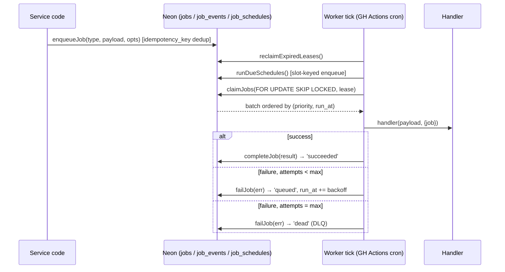

# Background Job Platform (Phase 4 — Milestone 1)

Durable, Postgres-backed job queue for every asynchronous need the platform has now and every
one the provider integrations will add later (portfolio sync, statement sync, order
reconciliation, email delivery, webhook processing, report generation, nightly cleanup…).

Code: [frontend/app/lib/platform/jobs/](../frontend/app/lib/platform/jobs/) · Schema:
[sql/neon/012_job_platform.sql](../sql/neon/012_job_platform.sql) · Worker entry:
[frontend/scripts/jobs_worker_tick.mjs](../frontend/scripts/jobs_worker_tick.mjs) · Cron:
[.github/workflows/jobs-worker.yml](../.github/workflows/jobs-worker.yml) · Status:
`GET /api/internal/jobs/status`

## 1. Architecture

**Why a Postgres queue, not Redis/SQS/QStash:** the app runs on Vercel serverless (no
long-lived worker process allowed) and the brief requires provider independence. Neon is
already the transactional system of record; putting the queue there means jobs are enqueued in
the same database as the state they operate on, there is no new external service to buy or
mock, and the whole platform stays testable against one real database. Throughput needs here
are modest (thousands/day, not thousands/second) — well inside Postgres queue territory.

**Execution model:** short-lived worker *ticks* instead of a resident worker. A tick =
`runWorkerTick()`: recover expired leases → enqueue due schedules → claim and execute due jobs
until drained or time budget spent. GitHub Actions cron fires a tick every 15 minutes; any
number of extra ticks (manual dispatch, a future API-triggered drain, tests) can overlap
safely because claiming uses `FOR UPDATE SKIP LOCKED` and crash recovery is lease-based.

**Delivery semantics: at-least-once.** A worker that dies after a side effect but before
`completeJob()` leaves a `running` row whose lease expires; the next tick requeues it and the
handler runs again. Therefore **every handler must be idempotent** — same input, safe to run
twice. This is a hard authoring rule (see §6), the same rule real provider work needs anyway
(BSE order submission will use provider-side idempotency references).

## 2. Status model

`queued → running → succeeded | dead | cancelled`, with retries expressed as
`running → queued` (future `run_at`). There is deliberately no separate `failed` interim
status: **retry visibility lives in `job_events`** (`retry_scheduled` with error + delay), and
`last_error` on the row always shows the most recent failure. `dead` is the dead-letter queue —
rows are kept (90 days, then pruned) for inspection and can be revived with
`requeueDeadJob(id)`.

## 3. Feature map (brief requirement → mechanism)

| Requirement | Mechanism |
|---|---|
| Queued jobs | `enqueueJob()` → `jobs` row |
| Scheduled / delayed jobs | `run_at` in the future (`delaySeconds`/`runAt`) |
| Recurring jobs | `job_schedules` (interval_seconds or daily_at UTC), enqueued by `runDueSchedules()` |
| Priority jobs | `priority` 1–9, claim orders by `(priority, run_at)` |
| Retry + exponential backoff | `failJob()` requeues with `min(base·2^(attempt−1), max) ± 25% jitter` |
| Dead letter queue | `status='dead'` after `max_attempts`; `requeueDeadJob()` revives |
| Job history | `job_events` (every transition) + terminal rows retained per §7 |
| Job monitoring / metrics | `getJobMetrics()` → `GET /api/internal/jobs/status` |
| Job cancellation | `cancelJob()` — queued only, by design (a running worker may be mid-side-effect) |
| Idempotent execution | at-least-once + mandatory idempotent handlers + `idempotency_key` unique enqueue |

## 4. Failure modes & recovery

| Failure | What happens | Recovery |
|---|---|---|
| Handler throws | `failJob`: requeue with backoff, or dead-letter at max_attempts | automatic; DLQ inspectable via status endpoint |
| Worker process dies mid-job | row stays `running` until `lease_expires_at` | next tick's `reclaimExpiredLeases()` requeues (or dead-letters if attempts exhausted) with a `lease_reclaimed` event |
| Two ticks overlap | `SKIP LOCKED` — they claim disjoint sets | none needed |
| Tick crashes between schedule-enqueue and schedule-advance | job idempotency key `sched:<name>:<slot>` blocks a second enqueue for the same slot | automatic (tested) |
| GH Actions cron delayed/skipped | queue simply drains on the next tick; `oldestDueSeconds` in metrics surfaces lag | monitor via status endpoint; manual `workflow_dispatch` drains immediately |
| DATABASE_URL missing | workflow fails fast with an explicit repo-secrets error; status endpoint 503s honestly | operator fixes secret |
| Unknown job type (handler not registered) | fails like any error → retries → dead-letters with explicit message | register the handler, `requeueDeadJob` |

## 5. Operational notes

- Cadence: cron `*/15`; a job enqueued between ticks waits ≤ ~15 min. That is acceptable for
  every current job type; latency-sensitive future types (e.g. email delivery) can either ride
  a tighter cron or be drained by an API-route tick after enqueue — the core supports both.
- One tick claims ≤ 50 jobs (`JOBS_MAX_PER_TICK`) within a 4-minute budget
  (`JOBS_TICK_BUDGET_MS`); leases run 5 minutes. Raise via workflow env if a backlog forms.
- Job failures do **not** fail the workflow run (they're queue state, not worker failure);
  dead-letters emit a GitHub Actions `::warning::` for visibility.
- Retention: succeeded/cancelled 30 days, dead 90 days, enforced by the seeded
  `job-history-prune-daily` schedule. The other seed, `vault-retention-sweep-daily`, enforces
  Document Vault `expires_at`.

## 6. Extension guide — adding a job type

1. Create `frontend/app/lib/platform/jobs/handlers/<name>.js`:
   `async (payload, { job }) => result`, **idempotent**, returning a small JSON-able summary.
   Register at module bottom: `registerHandler("my-type", myHandler)`.
2. Add it to `handlers/index.js` imports (that file *is* the production handler set).
3. Enqueue from service code: `enqueueJob("my-type", { … }, { idempotencyKey?, priority?, delaySeconds?, correlationId? })`.
   Recurring instead? Insert a `job_schedules` row in a migration.
4. Test both the handler (direct call, real DB, disposable rows) and one queue round-trip.
   The test suite in `jobPlatform.test.js` shows the pattern, including how tests namespace
   types (`test-<run>-…`) so they never collide with production jobs.

Provider integrations (M2+) consume this platform rather than extending it: webhook processing,
reconciliation runs, and notification delivery each become job types with their own handlers.

## 7. Verification record (M1)

- 22 tests green (20 real-Neon integration + 2 route), covering enqueue/dedup, priority
  ordering, delay, exclusive claiming, completion, backoff bounds, DLQ + revive, cancellation
  rules, lease recovery (both branches), schedule slot-idempotency incl. crash simulation,
  full tick drain (success/retry/dead in one pass), maxJobs ceiling, both real handlers, and
  metrics shape.
- Deployed schema live on Neon `production` branch; seeded schedules visible via
  `GET /api/internal/jobs/status`; first real worker run verified via
  `gh workflow run jobs-worker.yml` (see the workflow's run log for the JSON tick summary).
