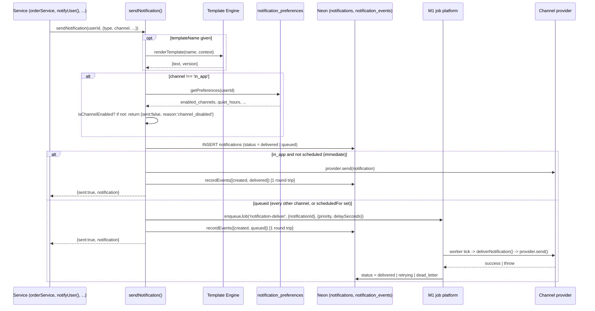
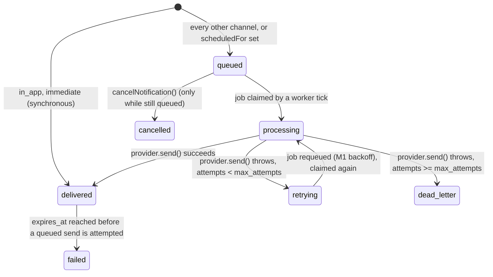

# Notification Platform (Phase 5 — Milestone 5)

The channel every part of MF Pulse communicates through — not a one-off email helper. A single
`sendNotification()` entry point resolves content (direct or via the M4.5 Template Engine),
evaluates the recipient's preferences, selects a channel, and either delivers synchronously
(in-app) or hands off to the M1 job platform for async delivery with retry/backoff and a
dead-letter outcome, auditing every state transition along the way.

Per the standing Phase 5 constraint, **only In-App has a working implementation.** Email, SMS,
Push, WhatsApp, and Webhook are provider-independent by construction (same interface, same
registry, same pipeline) but are not plugged in — see [§3](#3-provider-independence--adding-a-real-channel).

Code: [frontend/app/lib/platform/notifications/](../frontend/app/lib/platform/notifications/) ·
Schema: [sql/neon/016_notification_platform.sql](../sql/neon/016_notification_platform.sql)

## 1. Architecture

**Pipeline stages map to the brief's list as:** Business Event (the caller — `notifyUser()` or a
direct `sendNotification()` call) → Notification Request (`opts`) → Template Resolution (§ above,
delegates entirely to `templates/core.js`, see `docs/TEMPLATE_ENGINE.md`) → Preference Evaluation
(§4) → Channel Selection (`opts.channel`, default `in_app`) → Provider Selection
(`registry.js#getChannelProvider`) → Retry Framework / Circuit Breaker (§2 — pushed to the
channel provider, not owned by core.js) → Queue (M1 `enqueueJob`) → Delivery
(`deliverNotification`) → Tracking (`status`, `notification_events`) → Audit (`recordEvent(s)`,
every transition). Metrics and Reconciliation are out of scope for this sub-step — they land with
M5 sub-step 6 (internal ops APIs) reusing the same `notification_events` log as their source of
truth, not a parallel counter.

**Every stage is modular** in the sense the brief asks for: `core.js` never imports a channel
implementation directly (only `registry.js#getChannelProvider`, which returns whatever was last
registered), never imports a specific template (only `renderTemplate(name, ctx)` by name), and
never touches the `jobs` table directly (only `enqueueJob`/`registerHandler`). Swapping any one
of those pieces — a new channel, a new template, a different queue backend — never requires a
change to `core.js`.

## 2. State machine

`status` is deliberately **only the delivery sub-machine** — the 10 states the brief names split
into two orthogonal groups:

| Brief's state | Where it lives |
|---|---|
| Queued, Processing, Delivered, Failed, Retrying, Dead Letter, Cancelled | `notifications.status` (mutually exclusive, the diagram above) |
| Read, Dismissed, Archived | independent nullable timestamps (`read_at`, `dismissed_at`, `archived_at`) |

Reading, dismissing, or archiving a notification is orthogonal to how it was delivered — a
`dead_letter` notification can still be read; a `delivered` one can be archived without implying
anything about its delivery outcome. Folding all ten into one enum would require "un-delivering"
a notification the moment a user reads it, which is not a real state transition. Every one of the
ten is still independently queryable and every transition — delivery or engagement — is logged
to `notification_events`, so nothing in the brief's list is unaudited; they're just modeled as
two small orthogonal machines instead of one large one.

## 3. Provider independence & adding a real channel

Same swap-point pattern as M2 (payment providers) and M4.5's Provider Registry, applied to
notification channels:

- **`types.js`** — `NotificationProvider` base class: `send(notification)` (must throw on
  failure) and `getHealth()` (default `{status: 'healthy'}`, overridden by anything with real
  internal failure state to report).
- **`registry.js`** — `registerChannelProvider(channel, provider)` /
  `getChannelProvider(channel)` / `registeredChannels()`. Holds live, invokable instances (a
  Map), deliberately separate from the cross-cutting Provider Registry
  (`platform/providerRegistry/`), which holds only operational metadata (version, health,
  capabilities) — the same split `invest/providers/` already established; see
  `docs/PROVIDER_REGISTRY.md` §"Registry vs. domain modules".
- **`channels/index.js`** — the one file that wires instances together: instantiates each
  provider, calls `registerChannelProvider`, then separately registers the same instance's
  *metadata* into the Provider Registry (`notification-channel-<channel>`) via
  `deriveCapabilities(NotificationProvider)` (capabilities can never drift from what the class
  actually implements) and `getHealth: () => provider.getHealth()` (every channel's health comes
  from the instance itself — this file never hand-copies per-channel health logic).

**As of sub-step 2**: `channels/inApp.js` is the only REAL implementation —
`InAppNotificationProvider.send()` is a no-op returning `{delivered: true}`, because for
`in_app`, writing the `notifications` row already *is* the delivery; there is no external call to
make. Every other channel — `email`/`sms`/`push`/`whatsapp`/`webhook` — has a **mock** adapter
(`channels/mock/Mock*Provider.js`), registered in `mode: 'sandbox'` (vs. in-app's `'production'`):
each `send()` deterministically returns a plausible fake provider response (a synthetic message
ID via the same `mockRef()` helper `invest/providers/mock/` uses, so "what does a mock reference
look like" has one answer platform-wide) without ever attempting a real network call, and each
wraps that no-op in its **own** Circuit Breaker instance, constructed from
`getProviderConfig('notification-channel-<channel>')` — the Configuration→Circuit-Breaker
composition the brief's per-channel architecture names is genuinely wired, not just decorative,
even though a mock that always succeeds will never actually trip it. Retry is deliberately NOT
implemented inside these adapters — a queued channel's retry comes for free from the M1 job's own
requeue-with-backoff (see `docs/RETRY_FRAMEWORK.md`'s job-queue-backed-retries split), so an
adapter's only contract is "let a failure throw." Recipient contact resolution (an email address,
a phone number, a device token) is deliberately NOT modeled anywhere yet — the schema has no such
column, and a mock has nothing to send an address to; that lookup is a real adapter's own concern
to add when it lands, not something to guess at now.

A gap worth recording because it wasn't obvious until a real consumer hit it: `getHealth()`
cannot simply return a circuit breaker's own `getMetrics()` — the breaker reports `state`
(closed/open/half_open), but the Provider Registry's `runProviderConformanceCheck` requires a
`status` field, and the two vocabularies were never reconciled anywhere before these mocks existed
(no earlier provider used a breaker AS its `getHealth()` source). Fixed via a small
`channels/mock/breakerHealth.js` adapter (`state` → `status` via a fixed mapping, spreading the
rest of the metrics through unchanged) — worth reusing for any future breaker-backed provider
outside notifications too, rather than rediscovering the same gap.

**Adding a real provider later is exactly the four steps the brief specifies**, and needs zero
changes to `core.js`:
1. Replace the `Mock*Provider` with an adapter class extending `NotificationProvider`, wrapping
   the vendor SDK call in the same Circuit Breaker composition the mock already established.
2. Swap the registration in `channels/index.js` (`new ResendEmailProvider(...)` in place of `new
   MockEmailProvider()`) — the channel key, Provider Registry name, and everything downstream
   (core.js, the job handler, future public/internal APIs) needs no change.
3. Supply real credentials via the Configuration Platform, not hardcoded.
4. Run it through the conformance suite: `runProviderConformanceCheck('notification-channel-
   <channel>')` (generic registration-shape check, from the Provider Registry itself) plus
   `channels/channels.test.js`'s behavioral pattern (does `send()` actually resolve for a
   well-formed notification, is the breaker genuinely exercised) — both already exist and already
   run against every mock channel today, so a real adapter is verified by the exact same suite,
   not a bespoke one written for it.

No business logic anywhere else — `notifyUser()`, `orderService`, the eventual public APIs —
needs to know a real provider exists.

## 4. Preference evaluation

`getPreferences(userId)` returns a real `notification_preferences` row, or an in-memory default
(`{enabled_channels: ['in_app'], quiet_hours: null, ...}`) if the user has none — matching the
schema's own comment that absence means "all defaults," not "blocked." `in_app` skips the
preference round-trip entirely and always sends: it's the schema's own always-on default with no
UI/API yet to disable it, so evaluating preferences for it would be a pure-overhead no-op on the
hottest path in the system (every existing `notifyUser()` call site). Every other channel is
evaluated against `enabled_channels` before a row is even written; a disabled channel returns
`{sent: false, reason: 'channel_disabled'}` — a normal, expected outcome, not an error, matching
`emitEvent`'s own "never throw for an expected non-send" precedent from the Event Bus.

Quiet hours, digest batching, and per-category overrides are schema-ready
(`quiet_hours_start/end`, `digest_enabled/frequency`, `category_settings`) but not yet evaluated
by `sendNotification` — that lands with M5 sub-step 3 (User Preferences), which also needs the
brief's explicit "Critical bypasses quiet hours" rule. Recording this now rather than silently:
today, *no* channel respects quiet hours yet, including non-critical ones on non-in_app channels,
because no channel is live to actually test that gate against.

## 5. Failure modes & recovery

| Failure | Behavior | Recovery |
|---|---|---|
| Missing `type` or `title` (and no template) | Throws before any row is written | Fix the caller |
| Channel not in user's `enabled_channels` | `{sent:false, reason:'channel_disabled'}`, no row written | Expected; user can opt in later (M5 sub-step 3 UI) |
| `provider.send()` throws (immediate/in-app path) | Propagates to the caller — in-app has no queue to fall back on | Caller's own error handling; `notifyUser()`'s callers already tolerate this since it matches pre-M5 behavior |
| `provider.send()` throws (queued path), attempts < `max_attempts` | Row → `retrying`, event `retry_scheduled`, error rethrown so M1's `failJob` drives the real requeue/backoff | Automatic — next worker tick after backoff |
| `provider.send()` throws, attempts >= `max_attempts` | Row → `dead_letter`, event `dead_lettered`, `last_error` populated | Manual: fix the provider issue, `requeueDeadJob` (M1) against the underlying job |
| No channel provider registered (`email` etc., today) | `deliverNotification` throws `no channel provider registered for '<channel>'`, job dead-letters honestly | Register a real adapter (§3) — not a bug to silently swallow |
| `expires_at` reached before a queued job is worked | Row → `failed`, event `failed` (reason `expired`), delivery skipped | None needed — by design (a scheduled notification whose relevance window passed) |
| Notification already delivered, `cancelNotification()` called | No-op, returns `null` | Matches "cancellation before send" — a delivered notification cannot be recalled |

## 6. Design notes worth flagging

- **`recordEvents()` uses `clock_timestamp()`, not `created_at`'s column default.** The
  immediate and queued paths each log two events (`created`+`delivered`, `created`+`queued`) in a
  single multi-row `INSERT` to save a round trip. `now()`/`transaction_timestamp()` — the column
  default — is frozen for the whole statement, so every row in one multi-row `INSERT` would
  otherwise get an *identical* `created_at`, and with `id` a random `uuid` (no monotonic
  tiebreaker), `order by created_at` would have no reliable way to recover which event actually
  happened first. `clock_timestamp()` re-evaluates per row even within one statement, so ordering
  stays correct without a second round trip.
- **`notifyUser()` is a byte-for-byte-compatible wrapper.** Its signature and resulting row shape
  are unchanged from the pre-M5 Journey 2 version (see `invest/notifications.js`), so its six
  existing call sites (`identityService`, `documentService`, `orderService`, `portfolioService`,
  `complianceService`, and its own callers) needed zero changes — the same "no business logic
  needs modification" bar the brief sets for future channel providers, applied here to the
  engine's own first caller.
- **In-app writes are synchronous by design**, not an optimization shortcut: there is no external
  call for `in_app` to make, so queuing it through M1 would add latency and a dead-letter path for
  a channel that can never actually fail short of the database itself being down.

## 7. Verification record (M5 sub-step 1)

- 14 tests green: 11 real-Neon integration tests in `core.test.js` (immediate delivery + event
  log, required-field validation, template resolution, preference blocking, async queued→job→
  delivered, retry→dead-letter with full audit trail, all 5 state-transition helpers including
  idempotent no-ops, cross-user RBAC isolation, cancel-only-while-queued) + 3 in
  `notifications.test.js` proving `notifyUser()`'s exact backward compatibility (legacy call
  shape, `NotificationSent` still fires, minimal-args call still works).
- Full 49-file suite green after landing this sub-step, including `orderService.test.js`'s
  timing-sensitive terminal-order-refresh test — see below.
- **Regression found and fixed during downstream verification**: `orderService.test.js`'s
  "GET-equivalent refresh never regresses a terminal order" test failed
  (`expected 'processing' to be 'submitted'`) because the rewritten `notifyUser()` added DB
  round trips to a path with a hardcoded real-elapsed-time threshold
  (`orderService.js`'s `PROGRESSION_SECONDS.processing = 4`). Root-caused precisely, then fixed
  as a genuine hot-path optimization rather than just padding the threshold: skip preference
  evaluation for `in_app` (§4) and consolidate `created`+`delivered`/`created`+`queued` into one
  `recordEvents()` round trip (§6), cutting the immediate in-app path from 4 DB round trips to 2.

## 8. Verification record (M5 sub-step 2)

- 20 pure in-memory tests in `channels/channels.test.js` (no real Neon needed — channel
  registration/circuit-breaker/`send()` never touches the database): all 6 channels registered in
  both the channel registry and Provider Registry; `in_app` alone in `'production'` mode; every
  channel passes the generic `runProviderConformanceCheck` (registration shape); every channel's
  `send()` genuinely resolves for a well-formed notification; every mock channel's circuit
  breaker is genuinely exercised (`sampleSize` moves, `failureRate` stays 0) by a real `send()`
  call, not just present-but-inert; `in_app`'s health correctly stays the interface default since
  it has no breaker.
- Full sub-step-1 suite (`core.test.js` 11, `notifications.test.js` 3) re-verified green after
  `types.js`'s `getHealth()` addition and `channels/index.js`'s rewrite — confirms sub-step 2
  didn't regress sub-step 1's sendNotification/state-transition behavior.
- **Bug found and fixed before it shipped**: `runProviderConformanceCheck` failed all 5 mock
  channels with `"getHealth() result missing required field 'status'"` — a circuit breaker's
  `getMetrics()` uses `state`, not `status`; the Provider Registry (Phase 4.5) and Circuit
  Breaker Framework (also Phase 4.5) were never actually wired together by an earlier consumer,
  so this vocabulary mismatch had no chance to surface until now. Fixed via
  `channels/mock/breakerHealth.js` (§3).
- **Transient failure investigated and ruled out as environmental, not a regression**: running
  `channels.test.js` + `core.test.js` + `notifications.test.js` together produced 2 failures in
  `core.test.js`'s async-channel tests (a job stuck at `attempts: 0`, a fail-pair consumed by the
  wrong test) that did not reproduce running `core.test.js` alone seconds later (11/11 green).
  Consistent with this session's documented full-suite timing anomaly (see
  [[mfpulse-invest-phase3-gate]]) at a smaller scale than previously seen — not caused by any
  sub-step-2 code, confirmed by isolating rather than assumed.
