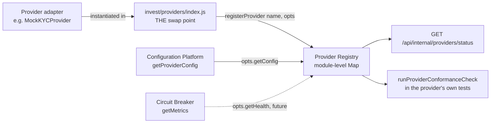

# Provider Registry (Phase 4.5 — Step 4)

The fourth shared primitive of the Provider Infrastructure Layer, and the piece that ties the
first three (Retry, Circuit Breaker, Configuration) together operationally. Every provider
registers its name/version/capabilities/health/config/mode here so the platform can report
installed/available providers, health, version, and errors from one place.

Code: [frontend/app/lib/platform/providerRegistry/core.js](../frontend/app/lib/platform/providerRegistry/core.js) ·
Status: `GET /api/internal/providers/status`

## 1. The FINAL GOAL this phase is building toward

> Integrating a new provider should require: 1. Implementing one adapter. 2. Registering it in
> the Provider Registry. 3. Supplying credentials. 4. Passing the conformance test suite. No
> business logic should need to change.

This module delivers steps 2 and 4 as reusable machinery — `registerProvider()` and
`runProviderConformanceCheck()` — proven against 5 *real* providers (below), not just a
synthetic example.

## 2. Architecture



**Deliberately additive to, not a replacement for,**
[`frontend/app/lib/invest/providers/index.js`](../frontend/app/lib/invest/providers/index.js) —
that file remains the ONE place deciding which concrete implementation backs each
KYC/Investment/Payment/Portfolio/Document interface (swapping a mock for a real CDSL/BSE Star
MF/CAMS/KFintech adapter is still a one-line change there, nothing to do with this registry).
The Provider Registry is a separate, cross-cutting layer for *operational metadata* about
whatever is plugged in — a second, additive concern, not a second swap mechanism.

Module-level `Map`, same convention as `jobs/registry.js`, `webhooks/registry.js`,
`events/registry.js`, `reconciliation/registry.js` — one process-wide registry, populated by
side-effect imports at module load time (`import "../../invest/providers/index.js"` in the
status route registers all 5 invest providers before the route reads from the registry).

## 3. What's registered today

The 5 existing invest mock providers, wired in
[`invest/providers/index.js`](../frontend/app/lib/invest/providers/index.js) as a real
demonstration, not just a theoretical example:

| Name | Capabilities (derived from the interface, not hand-typed) | Mode |
|---|---|---|
| `kyc` | `checkCKYCStatus`, `checkStatus`, `initiateVerification` | sandbox |
| `document` | `fetchDocument`, `generateDocument`, `storeUpload` | sandbox |
| `investment` | `cancelOrder`, `createSIPMandate`, `getOrderStatus`, `openAccount`, `placeOrder` | sandbox |
| `payment` | `getPaymentStatus`, `initiateMandate`, `initiatePayment` | sandbox |
| `portfolio` | `syncHoldings` | sandbox |

Capabilities come from `deriveCapabilities(InterfaceClass)`, which reflects on the interface
base class's own declared methods (`frontend/app/lib/invest/providers/types.js`) — a
registration can never silently drift from what the interface actually requires, because it
isn't hand-maintained. Each provider's `getConfig()` calls the real Configuration Platform's
`getProviderConfig(name)`, and each `getHealth()` reports a static `{status: 'healthy', mode:
'mock'}` rather than fabricated latency/error-rate numbers — there's no real operational signal
to report yet, and inventing one would be misleading. From M5 onward, notification channel
providers (Email/SMS/Push/WhatsApp mocks) register here the same way.

## 4. What the registry reports

- **`listAvailableProviders()`** — every registered provider, regardless of enabled state (what
  *could* be active).
- **`listInstalledProviders()`** — registered AND enabled (actively part of the running
  platform). A provider can be registered-but-disabled via a Configuration Platform flag without
  needing to be un-registered.
- **`getProviderStatus(name)`** / **`getAllProviderStatuses()`** — full per-provider snapshot:
  version, mode, capabilities, supportedFeatures, health, config, registeredAt. A throwing
  `getHealth()`/`getConfig()` degrades gracefully (reported as its own `{status: 'error', ...}`
  or `null`) rather than crashing the whole read — a broken health check must never itself look
  like a crash.
- **`getPlatformProviderSummary()`** — the platform-wide rollup the future operational dashboard
  (step 7) will consume: total/installed counts, counts by mode, and a `withErrors` list that
  catches both a plain `{status: 'error'}` health shape and a circuit-breaker-shaped
  `{state: 'open' | 'half_open'}` — the two health-reporting shapes providers are expected to use.

## 5. Extension guide

**Registering a new provider:**

```js
import { registerProvider, deriveCapabilities } from "../platform/providerRegistry/core.js";
import { getProviderConfig } from "../platform/config/core.js";
import { createCircuitBreaker } from "../platform/circuitBreaker/core.js";
import { MyRealInterface } from "./types.js";

const breaker = createCircuitBreaker("bse-star-mf");
registerProvider("bse-star-mf", {
  version: "1.0.0",
  capabilities: deriveCapabilities(MyRealInterface),
  mode: "production",
  getHealth: () => breaker.getMetrics(),        // circuit breaker's shape satisfies withErrors detection
  getConfig: () => getProviderConfig("bse-star-mf"),
});
```

**Proving the registration is well-formed** — call `runProviderConformanceCheck(name)` from the
provider's own test file:

```js
import { runProviderConformanceCheck } from "../../platform/providerRegistry/core.js";
it("passes the provider conformance check", () => {
  expect(runProviderConformanceCheck("bse-star-mf")).toEqual({ ok: true, issues: [] });
});
```

This checks the *registration's shape* (version is a string, capabilities/supportedFeatures are
arrays, mode is valid, health/config getters don't throw and return the required fields) — it
does not and cannot validate the provider's actual business behavior, which is that provider's
own integration test suite's job.

## 6. Failure modes & recovery

| Failure | Behavior | Recovery |
|---|---|---|
| `registerProvider()` called without a name | Throws immediately | Fix the call site |
| A provider's `getHealth()` throws when queried | Caught, reported as `{status: 'error', error: <message>}` in that provider's status | Investigate the provider's health-check logic; other providers' status reads are unaffected |
| A provider's `getConfig()` throws | Caught, reported as `config: null` | Investigate the provider's config source; doesn't block health reporting |
| `capabilities`/`supportedFeatures` given as a non-array (e.g. a string) at registration | Stored as-given (not silently coerced into a character array — see the code comment on why a naive spread would defeat this) so `runProviderConformanceCheck` correctly flags it | Fix the registration call site |
| `/api/internal/providers/status` queried before any provider module has been imported | Returns an empty `providers` array (nothing registered yet in this process) | Not an error — this route imports `invest/providers/index.js` itself specifically to guarantee registration happens before the read |

## 7. Testing

- **Unit tests** (`core.test.js`, 16 tests): defaults, available-vs-installed filtering,
  full status shape, graceful degradation on throwing health/config getters, the summary rollup's
  error-detection across both health shapes, `deriveCapabilities` against the real `KYCProvider`
  interface (not a synthetic stand-in), and the full conformance-check matrix (good registration,
  bad shapes, throwing getters, missing required fields, unregistered name).
- **Integration test** (`invest/providers/index.test.js`, 4 tests): proves the *real* wiring —
  importing `providers/index.js` actually registers all 5 mock providers, their derived
  capabilities match the real interfaces exactly, every one passes its own conformance check, and
  each one's config genuinely comes from the Configuration Platform (not a stub).
- **Route tests** (`route.test.js`, 2 tests): 200 with real provider data + summary +
  `generatedAt`; 500 with the error message when the registry query fails.
- **Regression**: `mockProviders.test.js` (the pre-existing 22-test suite for the Mock* classes
  themselves) re-run unmodified to confirm the registration wiring added to `index.js` didn't
  change any provider's actual behavior.
- **Deployment verification**: `npm run build` clean (confirms `/api/internal/providers/status`
  appears in the route manifest), full suite green.

## 8. Verification record

- 16 registry unit tests + 4 real-wiring integration tests + 2 route tests, all green.
- Pre-existing 22 mock-provider tests unaffected.
- A real bug caught by the test suite itself during development: `registerProvider`'s original
  implementation spread `capabilities`/`supportedFeatures` unconditionally
  (`[...capabilities]`), which silently coerces a non-array string input into a character array
  via JS's iterable-spread behavior — defeating `runProviderConformanceCheck`'s
  `Array.isArray()` validation by making clearly-wrong input look shape-valid. Fixed to only
  spread when the input is actually an array, preserving anything else as-given so the
  conformance check can correctly flag it.
- Full suite green, lint clean, production build clean.
