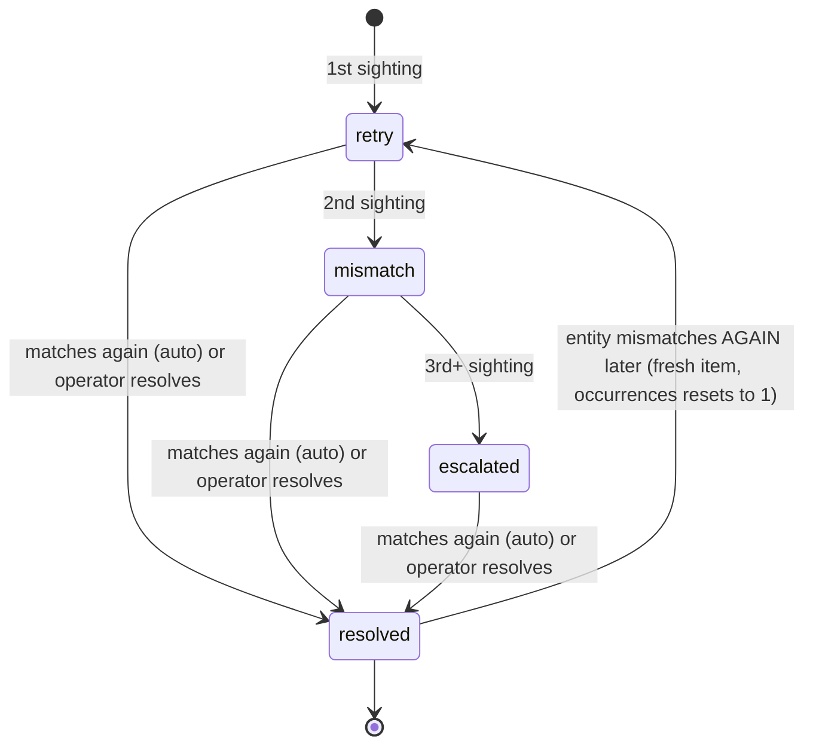

# Reconciliation Engine (Phase 4 — Milestone 3)

Exception-based reconciliation: compare internal state against external truth, track only the
discrepancies (not every clean match), and escalate anything that won't go away on its own.
Built on the M1 job platform (scheduled runs are jobs) and already exercises the M2 webhook
platform's own data (one comparator watches webhook processing lag) — this milestone is the
first to sit *on top of* both prior ones rather than beside them.

Code: [frontend/app/lib/platform/reconciliation/](../frontend/app/lib/platform/reconciliation/) ·
Schema: [sql/neon/014_reconciliation.sql](../sql/neon/014_reconciliation.sql) · Status:
`GET /api/internal/reconciliation/status` · Resolve: `POST /api/internal/reconciliation/items/{id}/resolve`

## 1. Model

**A run** (`reconciliation_runs`) executes one comparator once: loads pairs, classifies each,
records totals, and terminates `completed` or `failed`. **An item** (`reconciliation_items`) is
a *persistent, escalating* record of one entity's discrepancy — at most one **open** row per
`(recon_type, entity_key)` (enforced by a partial unique index), so three consecutive bad runs
against the same order produce one row that escalated, not three unrelated rows.

Status ladder, driven by `occurrences`:



`retry` deliberately assumes good faith on the first sighting — most single-run mismatches in a
system with async settlement (order status, webhook processing) are timing, not real breakage.
`mismatch` (2nd) says "this isn't timing." `escalated` (3rd+) says "an operator should look."
Resolution — auto (matched again) or manual (an advisor/admin's note) — is always terminal for
that occurrence chain; a later fresh mismatch opens a **new** item at occurrence 1, not a
reopened old one, so the history stays honest about *when* each discrepancy episode happened.

## 2. Comparator contract

A comparator is the only thing a new reconciliation needs — the engine, ladder, persistence,
and job wiring are all shared:

```js
registerComparator({
  type: "my-thing-vs-provider",
  entityType: "my_thing",
  async loadPairs(scope) {
    // Return [{ key, internal, external }] — internal/external null when that side is
    // missing. Loading BOTH sides is the comparator's job; the engine never assumes where
    // "external truth" comes from (a mock provider today, BSE/RTA tomorrow).
  },
  compare(internal, external) {
    // Called only when both sides exist.
    return { matched: boolean, diffs: [{ field, internal, external }] };
  },
});
```

Two escape hatches for checks that aren't natural two-sided comparisons:
- `{ key, exception: { kind, diffs } }` — an explicit finding (used by the webhook-lag
  comparator: "this delivery has been stuck for 45 minutes" has no natural "external value" to
  diff against).
- `{ key, matched: true }` — an explicit clean bill, so a comparator whose check is inherently
  single-sided can still auto-resolve a previously open item once the condition clears.

Classification is otherwise automatic: `external == null` → `missing_external`,
`internal == null` → `missing_internal`, both null → skipped (not counted, not an exception —
a comparator shouldn't really yield that pair, and the engine treats it as inert if it does),
`compare()` returns `matched: false` → `value_mismatch` with the returned diffs.

## 3. The four comparators shipped in M3

| Type | Checks | External truth |
|---|---|---|
| `documents-vault-integrity` | Every `completed` order has its auto-generated `investment_confirmation` document | Same database (documentService's own guarantee) |
| `orders-provider-linkage` | Every non-draft, non-cancelled order carries `provider` + `provider_order_id` | Same database — the linkage itself is the thing being checked, since a stateless mock provider has no order memory to compare a status against |
| `holdings-vs-provider` | `portfolio_holdings` (source `mock-connected`) units/folio match what `portfolioProvider.syncHoldings()` reports | `PortfolioProvider` interface — swapping in a real RTA changes the provider import, not this comparator |
| `webhook-processing-lag` | No incoming webhook delivery stuck `received`/`processing` past 30 minutes | Same database (M2's own delivery-status truth vs. queue truth) |

All four are genuinely exercised against real data in tests — not `matched: true` no-ops. The
`holdings-vs-provider` comparator in particular is the template for every future
external-provider reconciliation: real comparison logic, provider abstraction already in place,
0.001-unit tolerance for floating-point noise, `avg_cost` deliberately excluded (it's an
internal NAV-derived figure, not provider truth).

Each runs daily via a seeded `job_schedules` row → `reconciliation-run` job → `runReconciliation(reconType)`.

## 4. Resolution and RBAC

`POST /api/internal/reconciliation/items/{id}/resolve` is gated on
`requireRole(["advisor", "admin"])` — this is the **first real caller** of `apiAuth.js`'s
`requireRole`/`getUserRole` primitives (they existed, unused, since migration 009). It correctly
fails closed today: `users.role` defaults to `'investor'` and nothing yet promotes anyone to
`advisor`/`admin`, so the route is unreachable until an operator manually runs
`update users set role = 'advisor' where id = …`. That's the correct state for an unfinished
promotion flow, not a gap — Milestone 12 (Security Hardening) adds the promotion mechanism and
broader route-level policy; this route becomes one more consumer of it then, not a rewrite.

## 5. Failure modes & recovery

| Failure | Behavior | Recovery |
|---|---|---|
| Comparator's `loadPairs` throws | Run marked `failed` with the error; job platform retries per its own backoff | Fix the comparator / investigate the upstream failure recorded in `reconciliation_runs.error` |
| Unregistered `reconType` | Throws immediately, no run row created | Wire the comparator into `comparators/index.js` |
| A real discrepancy that never resolves | Escalates to `escalated` after 3 sightings and stays there | Operator resolves via the endpoint (advisor/admin role required) with a note |
| Two schedules for the same type overlap | `runReconciliation` runs are independent inserts — safe; the open-item unique index means concurrent occurrence increments serialize via the row lock in `upsertException`'s read-then-write | None needed |

## 6. Verification record (M3)

- 26 tests green (24 real-Neon integration + 2 route): ladder progression across real runs
  (retry→mismatch→escalated→auto-resolved→fresh-reopen), both classification paths
  (missing_internal/missing_external), value-mismatch diffs, the `{matched:true}` explicit-heal
  form, run-failure recording, scope auditing, manual resolution (incl. double-resolve
  rejection), metrics aggregation (payload-leak checked), and all four production comparators
  exercised against real inserted/updated rows including their auto-resolve paths.
- Two real bugs caught by these tests before deploy, both fixed: (1) `autoResolveIfOpen`'s SQL
  reused one parameter in both a text-concatenation and a uuid-column context, which Postgres's
  type inference collapsed to `text` and then rejected against the uuid column — fixed with
  explicit `::text`/`::uuid` casts; (2) `totals.checked` incremented before the both-null skip
  check, inflating counts for degenerate pairs — fixed by moving the skip check first.
