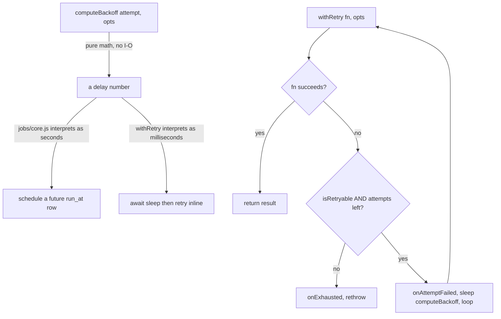

# Retry Framework (Phase 4.5 — Step 1)

The first shared primitive of the Provider Infrastructure Layer: one place that computes backoff
delays and runs retry loops, so the job platform, the future circuit breaker, and every future
provider adapter (email/SMS/push/BSE/CAMS/payments/...) share the same retry semantics instead of
each hand-rolling their own.

Code: [frontend/app/lib/platform/retry/core.js](../frontend/app/lib/platform/retry/core.js)

## 1. Architecture

Two independent layers — use whichever fits the caller:



- **`computeBackoff(attempt, opts)`** — pure delay math, no sleeping, no I/O. `strategy` is
  `'exponential'` (default), `'linear'`, or `'immediate'`. Caps at `max`, applies ±25% jitter
  (avoids a synchronized thundering herd when many failures happen at once), floors at 1 for
  non-immediate strategies. The unit of `base`/`max`/the return value is whatever the caller
  means it to be — `jobs/core.js` passes seconds (it's scheduling a future database row, often
  minutes-to-hours out); an inline caller passes milliseconds (it's really going to `setTimeout`
  on the result). The function itself has no opinion on units.
- **`withRetry(fn, opts)`** — an actual retry *loop* for synchronous-style, in-request retries
  that aren't backed by a persistent queue (e.g. a provider adapter's inline HTTP call). Always
  operates in milliseconds since it truly awaits a sleep between attempts.

**Job-queue-backed retries do not call `withRetry`.** The job platform's own requeue-with-`run_at`
*is* its retry loop (`jobs/core.js`'s `failJob`), and its `status = 'dead'` rows *are* its DLQ.
`jobs/core.js`'s `computeBackoffSeconds` now delegates to `computeBackoff` internally — same
formula, same export, same call sites, zero behavior change (proven by the pre-existing
`jobPlatform.test.js` backoff test, which was written against the original inline formula and
still passes unmodified against the delegated version).

## 2. Extension guide

**Wrapping an inline provider call** (e.g. a future email adapter's `send()`):

```js
import { withRetry, isRetryableByDefault } from "../platform/retry/core.js";

async function sendViaProvider(message) {
  return withRetry(() => httpClient.post("/send", message), {
    maxAttempts: 4,
    strategy: "exponential",
    baseMs: 200,
    maxMs: 5000,
    // isRetryable defaults to isRetryableByDefault (5xx/429/network-shaped errors); override
    // only if the provider's error shape needs domain-specific classification.
  });
}
```

**A new job type wanting different backoff behavior** — pass `backoffBaseSeconds`/
`backoffMaxSeconds` to `enqueueJob()` as already documented in `docs/JOB_PLATFORM.md`; no change
needed here, `computeBackoffSeconds` already delegates.

**Custom failure classification** — pass your own `isRetryable(error)` predicate to `withRetry`;
the default (`isRetryableByDefault`) treats HTTP 429/5xx and common network error codes
(`ECONNRESET`, `ETIMEDOUT`, `ECONNREFUSED`, `ENOTFOUND`, `EAI_AGAIN`, `EPIPE`) plus `AbortError`
as retryable, and defaults everything else — including unrecognized errors — to **terminal**.
This is deliberate: retrying blind on an error shape you don't recognize risks retrying something
permanent (a validation failure, a 4xx) as if it were transient.

## 3. Failure modes & recovery

| Failure | Behavior | Recovery |
|---|---|---|
| A wrapped call fails with a retryable error, under maxAttempts | `onAttemptFailed` fires, delay computed via `computeBackoff`, loop continues | Automatic — no action needed |
| A wrapped call fails with a non-retryable error | Stops immediately (does not burn remaining attempts), `onExhausted` fires, rethrows | Fix the underlying call; the error was correctly classified as not worth retrying |
| maxAttempts exhausted on a persistently retryable error | `onExhausted` fires, rethrows the last error | Caller decides: job-queue callers already dead-letter via `failJob`; non-queue callers should implement their own `onExhausted` if they need persistence — none currently do |
| Unknown `strategy` or `attempt < 1` passed to `computeBackoff` | Throws immediately (programmer error, not a runtime failure) | Fix the call site |

## 4. Testing

Pure utility module — no database, no routes, no network. The testing checklist from the Phase
4.5 brief is applied selectively rather than padded with categories that don't fit:

- **Unit tests** (`core.test.js`, 17 tests): every strategy's math, jitter bounds, the
  never-below-1 floor, `isRetryableByDefault`'s classification table, `withRetry`'s success/
  retry/exhaustion/non-retryable-short-circuit paths, and that `onAttemptFailed`/`onExhausted`
  fire the expected number of times with the expected arguments.
- **Retry & failure tests**: covered by the same suite (exhaustion path, non-retryable
  short-circuit, custom `isRetryable` override).
- **Concurrency**: one test proves independent concurrent `withRetry` calls don't share state
  (each tracks its own attempt count correctly under `Promise.all`).
- **Performance**: one test proves `strategy: 'immediate'` with a fast-failing function and 20
  attempts completes in well under a second — the injectable `sleep`/`random` aren't accidentally
  slow, and a caller that genuinely wants zero backoff gets zero backoff.
- **Integration / Real-Neon / Route tests**: not applicable — this module has no external
  dependencies of its own. Its real integration proof is the *existing*
  `jobPlatform.test.js` backoff test passing unmodified after the refactor, plus the full
  40-file suite staying green (regression proof that delegating `computeBackoffSeconds` changed
  nothing observable in the job platform).
- **Deployment verification / production smoke test**: `npm run build` clean, full suite green,
  and post-deploy confirmation that `/api/internal/jobs/status` still shows sane retry/backoff
  behavior for real job traffic (the job platform is this module's first live consumer).

## 5. Verification record

- 17/17 unit tests green.
- Pre-existing `jobPlatform.test.js` backoff test (`computeBackoffSeconds grows exponentially and
  caps at max`) passes unmodified against the delegated implementation.
- Full 40-file suite green after the refactor.
- Lint clean, production build clean.
