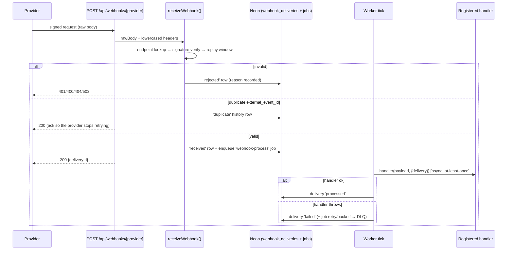

# Webhook Platform (Phase 4 — Milestone 2)

Generic webhook engine, both directions, built **on top of the M1 job platform** — retries,
backoff, and the failure queue are jobs; this milestone adds verification, replay protection,
duplicate detection, persistence, and the provider registration surface. A future real
provider (BSE order-status pushes, payment-gateway callbacks, KYC status updates) implements
**only a handler registration plus one `webhook_endpoints` row** — everything else is platform.

Code: [frontend/app/lib/platform/webhooks/](../frontend/app/lib/platform/webhooks/) · Schema:
[sql/neon/013_webhook_platform.sql](../sql/neon/013_webhook_platform.sql) · Incoming route:
`POST /api/webhooks/[provider]` · Status: `GET /api/internal/webhooks/status`

## 1. Incoming pipeline

Decisions worth knowing:

- **Verify before parse.** Signatures are HMAC-SHA256 over `"<timestamp>.<rawBody>"` bytes;
  the JSON is only parsed after the signature and replay window pass. Comparison is
  timing-safe (`crypto.timingSafeEqual`).
- **Replay protection** is the signed timestamp ± `tolerance_seconds` (default 300): a
  captured request replayed later fails the window, and a doctored timestamp breaks the HMAC.
- **Duplicate detection** keys on the provider's own event id via a partial unique index
  (`rejected` rows excluded, so a forged request can never squat a real event's id). Duplicate
  arrivals are ACKed 200 — the entire point is that the provider stops resending — and
  recorded as their own `duplicate` rows for event history.
- **Custom schemes.** Providers whose signature format is dictated by their official docs set
  `signature_scheme='custom'` and register a `verify()` — the platform never guesses an
  undocumented format (tested with a token-header example).
- **Secrets are env-var *names*** (`secret_env_var`) — never secret values in the database.
  With the env var unset, verification fails **closed** ("No signing secret configured"), so
  the seeded `mock-payments` endpoint safely 401s in production until a secret is configured.
- **Stored headers are a whitelist** (signature/timestamp/event-id/content-type/user-agent) —
  no full header dumps of IPs and cookies into the database.
- **Failure queue** = `webhook-process` jobs in the M1 DLQ + deliveries left `failed` with
  `last_error`; both visible in the status endpoints.

## 2. Outgoing deliveries

`emitOutboundEvent(eventType, payload)` fans out to every enabled `webhook_outbound` listener
whose `event_types` contains the event. Each (event, listener) pair is one
`webhook_outbound_deliveries` row plus one `webhook-outbound-deliver` job: a signed POST
(same HMAC scheme we verify inbound, headers `x-webhook-timestamp` / `x-webhook-signature` /
`x-webhook-delivery`), 10-second timeout, 2xx = delivered. Non-2xx or network failure throws —
the job platform retries with backoff; on the final attempt the delivery row is marked `dead`
so the deliveries table tells the truth without consulting the DLQ. Re-delivery of a
`delivered` row is a no-op (at-least-once safe).

No internal code emits outbound events yet — M4 (Event Bus) will connect domain events to
`emitOutboundEvent`, at which point listener registration becomes useful. Shipping the
mechanism first keeps M4 a pure wiring exercise.

## 3. Extension guide — integrating a real provider (when docs + credentials exist)

1. Insert a `webhook_endpoints` row: provider slug, `signature_scheme` (`hmac-sha256` if the
   provider lets us choose; `custom` if their docs dictate a format), `secret_env_var` name,
   tolerance.
2. Register in code (imported via `jobs/handlers/index.js`):
   `registerWebhookProvider("their-slug", { handler, verify?, extractEventId?, extractEventType? })`
   — `handler` must be idempotent; `verify` only for `custom`, written strictly from the
   provider's official documentation.
3. Set the secret in the environment (Vercel + GitHub Actions).
4. Point the provider at `https://<host>/api/webhooks/their-slug`.
5. Test with the same patterns as `webhookPlatform.test.js` (the mock-payments provider is the
   template).

## 4. Failure modes & recovery

| Failure | Behavior | Recovery |
|---|---|---|
| Bad signature / stale timestamp / forged request | 401, `rejected` row with reason, nothing enqueued | inspect `webhook_deliveries` rejects |
| Provider retries an already-received event | 200 ack, `duplicate` history row, no re-processing | none needed |
| Handler throws | delivery `failed` + job retry/backoff → DLQ after max attempts | fix handler / `requeueDeadJob` |
| Race: same event id arrives twice concurrently | unique index — loser records `duplicate` | none needed |
| Listener endpoint down (outbound) | retries with backoff; final attempt marks delivery `dead` | re-emit after listener recovers |
| Secret env var missing | fail-closed 401 on inbound; outbound sends unsigned only if no `secret_env_var` configured | set the env var (M10 config platform will validate at startup) |

## 5. Verification record (M2)

- 25 tests green (19 real-Neon/real-HTTP integration + 6 route), covering the signature scheme
  (round-trip, wrong secret, tamper, replay, missing headers), the full incoming pipeline
  (unknown/disabled/unconfigured providers, rejection recording, duplicate detection incl. the
  insert race, malformed-JSON-with-valid-signature, custom verify), processing (direct,
  failure, end-to-end through a worker tick), and outbound (event-type fan-out, signed POST
  verified by a real local HTTP listener, retry + final-attempt dead-marking, disabled-listener
  skip), plus metrics payload-leak checks.
- Production verification: `POST /api/webhooks/mock-payments` (unsigned) → 401 fail-closed;
  `GET /api/internal/webhooks/status` → aggregate counts + registered providers.
